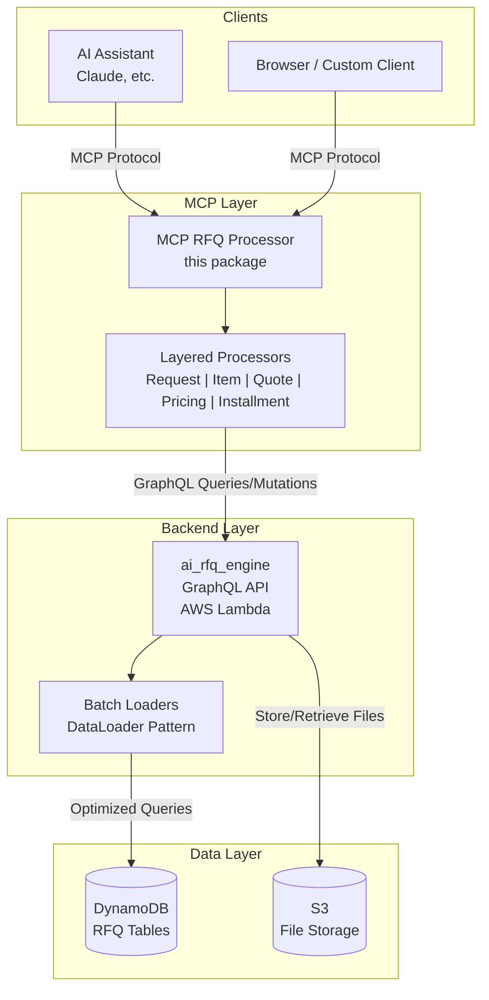
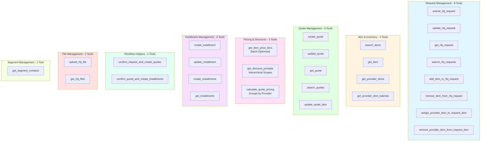

# MCP RFQ Processor

Model Context Protocol (MCP) server for processing Request for Quotation (RFQ) operations, providing AI assistants with tools to manage the complete RFQ lifecycle.

## Overview

The MCP RFQ Processor connects AI assistants to the `ai_rfq_engine` GraphQL backend, enabling intelligent automation of:

- **RFQ Request Management**: Submit, update, and track customer quotation requests with flexible item management
- **Item & Inventory Search**: Find available items and provider inventory with batch tracking
- **Quote Generation**: Create and manage detailed quotes with flexible item operations, pricing, and discounts
- **Installment Planning**: Set up payment schedules for quotes
- **Document Management**: Upload and track RFQ-related files
- **Segment Management**: Organize customers and providers into pricing segments

**Current Version**: 0.1.1
**Total MCP Tools**: 28 (implemented in `mcp_configuration.py`)

### Current Feature Highlights

- **Status-Aware Workflow Controls**
  - Requests, quotes, and installments enforce validated transitions with guard rails
  - Auto-update request status to `in_progress` when items change
  - Quotes auto-transition to `in_progress` when items are created
- **Automatic Business Rules**
  - Auto-disapprove quotes when a request is marked `modified`
  - Auto-complete quotes when all installments are `paid`, then auto-complete the request
  - When one quote is confirmed, competing quotes are disapproved (unless already terminal)
- **Provider Assignment Helpers**
  - `assign_provider_item_to_request_item` and `remove_provider_item_from_request_item` manage provider links on requests
  - Quote creation pulls assigned provider items to build quote items automatically
- **Pricing Intelligence with Batch Optimization**
  - `calculate_quote_pricing` uses email-based batch loaders to efficiently group request items by provider
  - Single GraphQL query retrieves all price tiers for all items using DataLoader pattern
  - `get_item_price_tiers` supports batch queries with email + quote_items array
  - `get_discount_prompts` efficiently loads discount prompts from all hierarchical scopes
- **Workflow Convenience**
  - `confirm_request_and_create_quotes` and `confirm_quote_and_create_installments` wrap multi-step flows for quicker automation

See [DEVELOPMENT_PLAN.md](DEVELOPMENT_PLAN.md) for complete workflow documentation.

## Architecture

### High-Level Architecture



### Component Flow

```
AI Assistant (Claude, etc.)
    ↓ MCP Protocol (28 Tools)
MCP RFQ Processor (this package)
    ├── Request Processor (8 tools)
    ├── Item Processor (4 tools)
    ├── Quote Processor (5 tools)
    ├── Pricing Processor (3 tools)
    ├── Installment Processor (4 tools)
    ├── File Processor (2 tools)
    └── Segment Processor (1 tool)
    ↓ GraphQL over AWS Lambda
ai_rfq_engine (backend)
    ├── Batch Loaders (v0.1.1)
    ├── Status Managers
    └── Business Rules Engine
    ↓
DynamoDB Tables + S3 Storage
```

## Installation

### Prerequisites

- Python >= 3.8
- AWS credentials with Lambda execution permissions
- Access to deployed `ai_rfq_engine` GraphQL endpoint

### Install from Source

```bash
cd mcp_rfq_processor
pip install -e .
```

### Install Dependencies

```bash
pip install boto3 humps pendulum silvaengine-utility
```

## Configuration

### MCP Server Configuration

Add to your MCP settings file (e.g., `claude_desktop_config.json`):

```json
{
  "mcpServers": {
    "rfq_processor": {
      "command": "python",
      "args": ["-m", "mcp_rfq_processor"],
      "env": {
        "ENDPOINT_ID": "your-endpoint-id",
        "AWS_REGION": "us-east-1",
        "AWS_ACCESS_KEY_ID": "your-access-key",
        "AWS_SECRET_ACCESS_KEY": "your-secret-key"
      }
    }
  }
}
```

### Module Settings

When using as a Python module:

```python
from mcp_rfq_processor import MCPRfqProcessor
import logging

logger = logging.getLogger(__name__)

processor = MCPRfqProcessor(
    logger=logger,
    region_name="us-east-1",
    aws_access_key_id="your-access-key",
    aws_secret_access_key="your-secret-key",
    execute_mode="aws_lambda",  # or "local" for testing
    default_batch_expiration_filter_days=90,  # Default: 90 days (~3 months)
    installment_scheduled_day=15,  # Default: 15th day of month for installment schedules
)

processor.endpoint_id = "your-endpoint-id"
```

**Configuration Options:**

| Setting | Type | Default | Description |
|---------|------|---------|-------------|
| `region_name` | string | - | AWS region where Lambda functions are deployed |
| `aws_access_key_id` | string | - | AWS access key ID |
| `aws_secret_access_key` | string | - | AWS secret access key |
| `execute_mode` | string | - | Execution mode: `aws_lambda` or `local` |
| `default_batch_expiration_filter_days` | integer | 90 | Default minimum expiration days for `get_provider_item_batches`. When no expiration filters are provided, only returns batches expiring this many days or more in the future. |
| `installment_scheduled_day` | integer | 15 | Day of month (1-31) for scheduled installment dates in `create_installments`. If day doesn't exist in a month (e.g., Feb 31), uses last day of that month. |

## Available MCP Tools

All 28 tools are defined in `mcp_configuration.py` and exposed by `MCPRfqProcessor`.

### Tool Organization



### 1. Request Management (8 tools)

#### `submit_rfq_request`
Submit a new RFQ request from a customer.

**Default Status**: `initial` - Request has been created but not yet being worked on.

**Input:**
```json
{
  "email": "customer@example.com",
  "request_title": "Need 500 units of Product X",
  "request_description": "Detailed requirements...",
  "billing_address": {},
  "shipping_address": {},
  "items": [],
  "notes": "Urgent order",
  "expired_at": "2025-12-31T23:59:59Z",
  "status": "initial"
}
```

**Output:**
```json
{
  "request_uuid": "generated-uuid",
  "status": "initial",
  "created_at": "2025-11-05T10:30:00Z",
  "items": []
}
```

#### `update_rfq_request`
Update an existing RFQ request (title, description, addresses, items, status, etc.).

**Status Transitions**: All status changes are validated according to the request status flow.

**Automatic Business Rules**:
- When status changes to `modified`, all related quotes are automatically set to `disapproved`
- When items are modified while in `modified` status, automatically transitions to `in_progress`

**Input:**
```json
{
  "request_uuid": "request-uuid-string",
  "request_title": "Updated title",
  "items": [...],
  "status": "confirmed"
}
```

**Output:** Updated request object.

#### `add_item_to_rfq_request`
Convenience method to add a single item to an existing request.

**Input:**
```json
{
  "request_uuid": "request-uuid-string",
  "item": {
    "item_uuid": "item-uuid",
    "quantity": 100
  }
}
```

**Output:** Updated request with new item added.

#### `remove_item_from_rfq_request`
Convenience method to remove a single item from an existing request.

**Input:**
```json
{
  "request_uuid": "request-uuid-string",
  "item_uuid": "item-uuid-to-remove"
}
```

**Output:** Updated request with item removed.

#### `assign_provider_item_to_request_item`
Attach a provider item (and optional batch/quantity) to a request item. Validates that the provider item belongs to the specified provider and updates status to `in_progress` when needed.

#### `remove_provider_item_from_request_item`
Remove provider assignments from a request item. Can target a specific provider item/batch or clear all provider items for the request item.

#### `get_rfq_request`
Retrieve details of an existing RFQ request.

**Input:**
```json
{
  "request_uuid": "request-uuid-string"
}
```

**Output:** Complete request object with contact info and associated quotes.

#### `search_rfq_requests`
Search and filter RFQ requests.

**Input:**
```json
{
  "contact_uuid": "optional-contact-uuid",
  "statuses": ["pending", "quoted"],
  "from_expired_at": "2025-01-01T00:00:00Z",
  "to_expired_at": "2025-12-31T23:59:59Z",
  "page_number": 1,
  "limit": 20
}
```

**Output:** Paginated list of matching requests.

---

### 2. Item & Inventory Management (4 tools)

#### `search_items`
Search for available items in the catalog.

**Input:**
```json
{
  "item_type": "product",
  "item_name": "Widget",
  "uoms": ["EA", "BOX"],
  "page_number": 1,
  "limit": 50
}
```

**Output:** List of items with descriptions, types, and UOM options.

#### `get_item`
Get detailed information about a specific item.

**Input:**
```json
{
  "item_uuid": "item-uuid-string"
}
```

**Output:** Complete item details including pricing tiers.

#### `get_provider_items`
Search provider inventory with batch information merged.

For each provider item, automatically fetches and merges batch information including:
- **batches**: Array of batch details with slow_move_item flags and guardrail pricing
- Each batch includes: batch_no, expired_at, produced_at, slow_move_item, guardrail_price_per_uom

Optional batch filters (applied when fetching batches):
- **expired_at_gt**: Filter batches expiring after this date
- **expired_at_lt**: Filter batches expiring before this date  
- **slow_move_item**: Filter for slow-moving inventory (default: false)
- **in_stock**: Filter for in-stock batches (default: true)

**Input:**
```json
{
  "item_uuid": "optional-item-uuid",
  "provider_corp_external_id": "PROVIDER-001",
  "min_base_price_per_uom": 10.00,
  "max_base_price_per_uom": 50.00,
  "expired_at_gt": "2025-11-05T00:00:00Z",
  "slow_move_item": false,
  "in_stock": true,
  "page_number": 1,
  "limit": 50
}
```

**Output:** List of provider items with pricing, availability, and merged batch information.

**Note:** If no expiration filters provided, defaults to batches expiring 90+ days from now.

#### `get_provider_item_batches`
Get batch/lot information for provider items including slow_move_item flag and guardrail pricing.

**Input:**
```json
{
  "provider_item_uuid": "provider-item-uuid",
  "in_stock": true,
  "expired_at_gt": "2025-11-05T00:00:00Z"
}
```

**Output:** List of batches with lot numbers, expiry dates, and stock levels.

**Note:** If neither expired_at_gt nor expired_at_lt is provided, defaults to filtering batches expiring 90+ days from now.

---

### 3. Quote Management (5 tools)

#### `create_quote`
Generate a new quote for an RFQ request.

**Default Status**: `initial` - Quote has been created but not yet being worked on.

**Requirements**:
- Request must be in `confirmed` status to create quotes

**Note**:
- `shipping_method` and `shipping_amount` cannot be set during creation - use `update_quote` after creation
- `rounds` (negotiation rounds) is auto-calculated by the backend
- Quote items are created automatically from the provider assignments on the request for the selected provider

**Input:**
```json
{
  "request_uuid": "request-uuid",
  "provider_corp_external_id": "PROVIDER-001",
  "sales_rep_email": "sales@provider.com",
  "status": "initial",
  "notes": "Initial quote"
}
```

**Output:**
```json
{
  "quote_uuid": "generated-quote-uuid",
  "request_uuid": "request-uuid",
  "rounds": 0,
  "total_quote_amount": 0.00,
  "status": "initial"
}
```

#### `get_quote`
Retrieve quote details.

**Input:**
```json
{
  "request_uuid": "request-uuid",
  "quote_uuid": "quote-uuid"
}
```

**Output:** Complete quote with line items, totals, and discount information.

#### `update_quote`
Update quote metadata (shipping, status, notes).

**Status Transitions**: All status changes are validated according to the quote status flow.

**Note**: `rounds` (negotiation rounds) is auto-calculated by the backend and cannot be manually set.

**Input:**
```json
{
  "request_uuid": "request-uuid",
  "quote_uuid": "quote-uuid",
  "shipping_method": "express",
  "shipping_amount": 75.00,
  "status": "confirmed",
  "notes": "Updated pricing and shipping"
}
```

**Output:** Updated quote object with auto-calculated `rounds`.

#### `search_quotes`
Search and filter quotes.

**Input:**
```json
{
  "request_uuid": "optional-request-uuid",
  "provider_corp_external_id": "PROVIDER-001",
  "statuses": ["confirmed", "completed"],
  "min_total_quote_amount": 1000.00,
  "page_number": 1,
  "limit": 20
}
```

**Output:** Paginated list of matching quotes.

#### `update_quote_item`
Update an existing quote item (discount amount only). Used to apply discounts after quote items are created.

**Requirements**:
- Quote must be in `in_progress` status to apply discounts
- Only discount modifications are allowed (discount amount adjustments)

**Note**: Only `discount_amount` can be updated. Other fields (qty, provider_item_uuid, etc.) are read-only after creation.

**Input:**
```json
{
  "quote_uuid": "quote-uuid",
  "quote_item_uuid": "quote-item-uuid",
  "discount_amount": 75.00
}
```

**Output:** Updated quote item with recalculated totals.

---

### 4. Pricing & Discounts (3 tools)

#### `get_item_price_tiers`
Get tiered pricing for multiple items using batch loader optimization.

**Batch-Optimized Approach**: Uses customer email for segment lookup and efficiently loads price tiers for quote items with automatic quantity filtering. Returns only tiers matching each item's quantity range. Preferred for processing multiple items efficiently.

**Input:**
```json
{
  "email": "customer@example.com",
  "quote_items": [
    {
      "item_uuid": "item-uuid",
      "provider_item_uuid": "provider-item-uuid",
      "qty": 100
    }
  ]
}
```

**Parameters:**
- `email`: Customer email address for segment lookup (required)
- `quote_items`: List of quote items with item_uuid, provider_item_uuid, and qty. Each item will have its applicable price tiers returned based on quantity thresholds.

**Output:** List of price tiers with provider_item_batches merged.

```json
{
  "item_price_tiers": [
    {
      "item_uuid": "...",
      "provider_item_uuid": "...",
      "quantity_greater_then": 50,
      "quantity_less_then": 200,
      "price_per_uom": 10.5,
      "margin_per_uom": 2.0,
      "provider_item_batches": [
        {
          "batch_no": "LOT-2025-001",
          "price_per_uom": 10.0
        }
      ]
    }
  ]
}
```

**Updated in v0.1.1**: Refactored to use batch loaders with email-based segment lookup for better performance.

#### `get_discount_prompts`
Get discount prompts for items using batch loader optimization.

**Batch-Optimized Approach**: Loads prompts from all hierarchical scopes (GLOBAL, SEGMENT, ITEM, PROVIDER_ITEM) and deduplicates. Returns combined discount prompts with conditions and rules. Preferred for processing multiple items efficiently.

**Input:**
```json
{
  "email": "customer@example.com",
  "quote_items": [
    {
      "item_uuid": "item-uuid",
      "provider_item_uuid": "provider-item-uuid"
    }
  ]
}
```

**Parameters:**
- `email`: Customer email address for segment lookup (required)
- `quote_items`: List of quote items with item_uuid and provider_item_uuid to determine applicable prompts

**Output:** Combined discount prompts from all hierarchical scopes.

```json
{
  "discount_prompts": [
    {
      "scope": "SEGMENT",
      "prompt": "Apply 5% discount for slow-moving items",
      "conditions": "slow_move_item=true",
      "max_discount_percentage": 5.0
    }
  ]
}
```

**New in v0.1.1**: Replaces `get_discount_rules` with batch-optimized prompt loading across hierarchical scopes.

#### `calculate_quote_pricing`
Calculate pricing information for an RFQ request using batch-optimized queries.

**Batch-Optimized Approach**: Groups items by provider and provides subtotals and price tiers. Uses batch loaders for efficient multi-item processing. Returns pricing structure for decision-making.

**Note**: This reads from REQUEST (not quote) and groups items by provider_corp_external_id. Use this BEFORE creating quotes (Step 7 in workflow).

**Input:**
```json
{
  "request_uuid": "request-uuid",
  "email": "customer@example.com"
}
```

**Parameters:**
- `request_uuid`: UUID of the RFQ request (required)
- `email`: Customer email for segment lookup and batch-optimized price tier queries (required)

**Output:** Grouped pricing structure with items grouped by provider.

```json
{
  "request_uuid": "req-uuid",
  "groups": [
    {
      "provider_corp_external_id": "PROVIDER-001",
      "items": [
        {
          "provider_item_uuid": "prov-item-uuid",
          "item_uuid": "item-uuid",
          "batch_no": "LOT-2025-001",
          "qty": 500,
          "price_per_uom": 9.50,
          "guardrail_price_per_uom": 9.50,
          "slow_move_item": true,
          "expired_at": "2026-03-15T00:00:00Z",
          "subtotal": 4750.00
        }
      ],
      "group_subtotal": 4750.00
    }
  ]
}
```

**Key Features:**
- Uses single batch-optimized GraphQL query for all price tiers
- Groups items by provider_corp_external_id for multi-provider comparison
- Includes batch-specific pricing with slow_move_item flags and guardrail pricing
- Returns pricing structure WITHOUT applying discounts (LLM can use get_discount_prompts separately)

**Updated in v0.1.1**: Refactored to use email-based batch loaders instead of segment_uuid. Price tiers and discount prompts now fetched separately via dedicated batch-optimized functions.

---

### 5. Installment Management (4 tools)

#### `create_installment`
Set up a payment installment for a quote.

**Requirements**:
- Quote must be in `confirmed` status to create installments

**Workflow:**
- Create installments with `status=pending` when quote status changes to `confirmed`
- Update installment `status=paid` when payment is received
- When all installments are `paid`, quote status is automatically set to `completed`

**Automatic Behavior:**
- **Amount**: If `installment_amount` not provided, uses full remaining balance. If provided, uses `min(requested_amount, remaining_balance)` (auto-caps at remaining balance)
- **Priority**: Automatically set to `max(existing_priorities) + 1` for sequential ordering (starts at 0 for first installment)
- **Due Date**: Automatically sets to current time (no need to specify)
- **installment_ratio**: Auto-calculated by backend based on `installment_amount` / `final_total_quote_amount`
- **Auto-Capping**: Requested amount > remaining balance automatically uses remaining balance instead

**Input Options:**

**Option 1: Full remaining balance (automatic)**
```json
{
  "quote_uuid": "quote-uuid",
  "request_uuid": "request-uuid",
  "status": "pending"
}
```

**Option 2: Partial installment (custom amount)**
```json
{
  "quote_uuid": "quote-uuid",
  "request_uuid": "request-uuid",
  "installment_amount": 3000.00,
  "status": "pending"
}
```

**Installment Status Values:**
- `pending`: Payment scheduled but not yet received (default when quote is confirmed)
- `paid`: Payment has been received and verified
- `cancelled`: Payment was cancelled or refunded

**Validation Rules:**
- **Without installment_amount**: Uses full remaining balance (`final_total_quote_amount - existing_pending_paid_total`)
- **With installment_amount**: Must be > 0. If exceeds remaining balance, automatically capped at remaining balance
- If remaining balance ≤ 0 (quote fully covered), installment creation is blocked
- Cancelled installments are not counted in the total
- Supports multiple partial installments that add up to quote total
- Auto-capping ensures you can never exceed quote total (safe to request any amount)

**Output:** Installment record with auto-calculated amount, due_date, and installment_ratio.

#### `update_installment`
Update installment status and sales order number.

**Status Transitions**: All status changes are validated according to the installment status flow.

**Automatic Business Rules**:
- When all installments are marked as `paid`, the quote is automatically set to `completed`

**Use Cases:**
- Mark installment as `paid` when payment is received
- Mark installment as `cancelled` if payment is cancelled or refunded
- Link installment to a sales order number for tracking

**Input:**
```json
{
  "quote_uuid": "quote-uuid",
  "installment_uuid": "installment-uuid",
  "status": "paid",
  "salesorder_no": "SO-12345"
}
```

**Common Usage:**
```json
// Mark as paid (triggers auto-complete check)
{
  "quote_uuid": "quote-uuid",
  "installment_uuid": "installment-uuid",
  "status": "paid"
}

// Link to sales order
{
  "quote_uuid": "quote-uuid",
  "installment_uuid": "installment-uuid",
  "salesorder_no": "SO-12345"
}

// Both at once
{
  "quote_uuid": "quote-uuid",
  "installment_uuid": "installment-uuid",
  "status": "paid",
  "salesorder_no": "SO-12345"
}
```

**Output:** Updated installment record.

#### `create_installments`
Create multiple payment installments for a quote based on a payment schedule. Automates the process of setting up installment plans (e.g., monthly payments over a year).

**Workflow:**
- Calculates remaining balance (`final_total_quote_amount - existing_pending_paid_total`)
- Divides remaining balance equally across `interval_num` installments
- Calculates scheduled dates based on `interval_num` and `total_pay_period`
- Creates all installments with `status=pending`
- Auto-increments priority for sequential ordering

**Automatic Behavior:**
- **Amount per installment**: `remaining_balance / interval_num` (equal distribution)
- **Scheduled dates**: First installment scheduled for the next payment period (not current period), then subsequent installments follow at regular intervals. All scheduled on the configured day of month (default: 15th) using `installment_scheduled_day` setting. If the day doesn't exist in a month (e.g., Feb 31), uses the last day of that month. Uses pendulum library for accurate date calculations.
- **Priority**: Auto-increments sequentially for each installment
- **Status**: All installments created with `pending` status

**Input:**
```json
{
  "quote_uuid": "quote-uuid",
  "request_uuid": "request-uuid",
  "interval_num": 12,
  "total_pay_period": 12
}
```

**Examples:**

**12 monthly payments over 1 year:**
```json
{
  "quote_uuid": "quote-uuid",
  "request_uuid": "request-uuid",
  "interval_num": 12,
  "total_pay_period": 12
}
// Creates 12 installments, scheduled monthly (every 1 month)
// First installment: Next month on 15th (or configured day)
// Last installment: 12 months from now on 15th
// Amount per installment: remaining_balance / 12
```

**6 bi-monthly payments over 1 year:**
```json
{
  "quote_uuid": "quote-uuid",
  "request_uuid": "request-uuid",
  "interval_num": 6,
  "total_pay_period": 12
}
// Creates 6 installments, scheduled bi-monthly (every 2 months)
// First installment: 2 months from now on 15th
// Last installment: 12 months from now on 15th
// Amount per installment: remaining_balance / 6
```

**4 quarterly payments over 2 years:**
```json
{
  "quote_uuid": "quote-uuid",
  "request_uuid": "request-uuid",
  "interval_num": 4,
  "total_pay_period": 24
}
// Creates 4 installments, scheduled every 6 months
// First installment: 6 months from now on 15th
// Last installment: 24 months from now on 15th
// Amount per installment: remaining_balance / 4
```

**Validation Rules:**
- `interval_num` must be > 0
- `total_pay_period` must be > 0
- Remaining balance must be > 0 (quote not already fully covered)
- If any installment creation fails, returns error with details of what was created

**Output:**
```json
{
  "installments": [ /* array of created installment objects */ ],
  "total_created": 12,
  "installment_amount_per": 833.33,
  "total_installment_amount": 10000.00
}
```

#### `get_installments`
Retrieve installments for a quote.

**Input:**
```json
{
  "quote_uuid": "quote-uuid"
}
```

**Output:** List of installments with payment schedule.

---

### 6. Workflow Convenience (2 tools)

These helpers combine multiple operations and enforce the same business rules described above.

#### `confirm_request_and_create_quotes`
Sets a request to `confirmed` and creates quotes for a list of providers in one call. Uses provider assignments on the request to generate quote items. Sales rep emails can be supplied via settings (`sales_rep_emails` mapping).

#### `confirm_quote_and_create_installments`
Confirms a quote, disapproves competing quotes for the same request, and creates a single installment or an installment schedule.

---

### 7. Document Management (2 tools)

#### `upload_rfq_file`
Upload a document related to an RFQ request.

**Input:**
```json
{
  "request_uuid": "request-uuid",
  "file_name": "specifications.pdf",
  "file_url": "s3://bucket/path/to/file",
  "file_type": "application/pdf",
  "email": "requester@company.com",
  "notes": "Technical specifications"
}
```

**Output:** File record with metadata.

#### `get_rfq_files`
Retrieve files associated with a request.

**Input:**
```json
{
  "request_uuid": "request-uuid"
}
```

**Output:** List of uploaded files with download URLs.

---

### 8. Segment Management (1 tool)

**Note:** Segments are typically managed through the backend admin interface. This tool provides read-only access to segment-contact associations for pricing lookups.

#### `get_segment_contacts`
List contacts in a segment by consumer corporation or email.

**Input:**
```json
{
  "consumer_corp_external_id": "CUSTOMER-001",
  "email": "buyer@customer.com",
  "page_number": 1,
  "limit": 50
}
```

**Output:** List of contacts with their segment associations.

---

## Usage Examples

### Complete RFQ to Quote Workflow

For the detailed 14-step workflow from customer inquiry to final quote confirmation, see [DEVELOPMENT_PLAN.md - Complete RFQ to Quote Workflow](DEVELOPMENT_PLAN.md#complete-rfq-to-quote-workflow).

**Quick Overview:**
0. Find Customer Segment
1. Submit RFQ Request
2. Lookup Items with End User
3. Add Items to Request
4. Lookup Provider Items for Each Item
5. Lookup Batches for Each Provider Item (Optional)
6. Assign Provider Items to Request Items
7. **Calculate Quote Pricing** (NEW - groups by provider/segment, returns discount rules)
8. Generate Quotes by Confirmation
9. Negotiate with End User
10. Apply Discounts with User Confirmation
11. Update Quote with Shipping
12. Confirm Quote and Generate Installment Plan
13. Complete Quote and Process Payment

### Practical Example: End-to-End Quote Generation

```python
# Step 0: Find customer segment
segment_contacts = processor.get_segment_contacts(
    consumer_corp_external_id="CUSTOMER-001",
    email="buyer@customer.com"
)
segment_uuid = segment_contacts[0]["segment_uuid"]

# Step 1-3: Create request and add items
request = processor.submit_rfq_request(
    email="buyer@customer.com",
    request_title="Q1 Production Materials",
    items=[]
)
request_uuid = request["request_uuid"]

processor.add_item_to_rfq_request(
    request_uuid=request_uuid,
    item={"item_uuid": "item-uuid-1", "qty": 500}
)

# Step 4-6: Assign provider items to request
current_request = processor.get_rfq_request(request_uuid=request_uuid)
updated_items = current_request["items"].copy()
updated_items[0]["provider_items"] = [
    {
        "provider_corp_external_id": "PROVIDER-001",
        "provider_item_uuid": "prov-item-uuid-1",
        "batch_no": "LOT-2025-001",
        "qty": 500
    }
]
processor.update_rfq_request(request_uuid=request_uuid, items=updated_items)

# Step 7: Calculate pricing with batch optimization (NEW)
pricing = processor.calculate_quote_pricing(
    request_uuid=request_uuid,
    email="buyer@customer.com"  # Uses email instead of segment_uuid
)
# Returns grouped pricing structure with items by provider
# {
#   "groups": [{
#     "provider_corp_external_id": "PROVIDER-001",
#     "items": [{
#       "provider_item_uuid": "prov-item-uuid-1",
#       "item_uuid": "item-uuid-1",
#       "batch_no": "LOT-2025-001",
#       "qty": 500,
#       "price_per_uom": 9.50,
#       "guardrail_price_per_uom": 9.50,
#       "slow_move_item": true,
#       "expired_at": "2026-03-15T00:00:00Z",
#       "subtotal": 4750.00
#     }],
#     "group_subtotal": 4750.00
#   }]
# }

# Optional: Get discount prompts separately
discount_prompts = processor.get_discount_prompts(
    email="buyer@customer.com",
    quote_items=[{
        "item_uuid": "item-uuid-1",
        "provider_item_uuid": "prov-item-uuid-1"
    }]
)

# Step 8-10: Create quote (quote items are auto-created from provider assignments)
quote = processor.create_quote(
    request_uuid=request_uuid,
    provider_corp_external_id="PROVIDER-001",
    sales_rep_email="sales@provider1.com"
)

# Apply discount to the created quote item
full_quote = processor.get_quote(
    request_uuid=request_uuid,
    quote_uuid=quote["quote_uuid"],
)
first_quote_item_uuid = full_quote["quote_items"][0]["quote_item_uuid"]

processor.update_quote_item(
    quote_uuid=quote["quote_uuid"],
    quote_item_uuid=first_quote_item_uuid,
    request_uuid=request_uuid,
    discount_amount=237.50  # 5% slow-move discount (user confirmed)
)

# Step 11: Add shipping
processor.update_quote(
    request_uuid=request_uuid,
    quote_uuid=quote["quote_uuid"],
    shipping_method="express",
    shipping_amount=75.00
)

# Step 12-13: Create installment plan and submit
# Installment automatically uses quote's final_total_quote_amount
processor.create_installment(
    request_uuid=request_uuid,
    quote_uuid=quote["quote_uuid"],
    status="pending"  # Default status when quote is confirmed
)

processor.update_quote(
    request_uuid=request_uuid,
    quote_uuid=quote["quote_uuid"],
    status="confirmed"
)
```

### Key Principles

- **LLM-Driven**: LLM asks user questions at each step
- **Segment-Based**: Always identify customer segment first for correct pricing
- **Information Provider**: `calculate_quote_pricing` provides discount rules; LLM makes decisions with user input
- **User Confirmation**: Apply discounts only after user confirms
- **Multi-Provider**: Create separate quotes per provider for comparison

### AI Assistant Conversation Example

```
User: I need a quote for 500 units of part ABC-123
