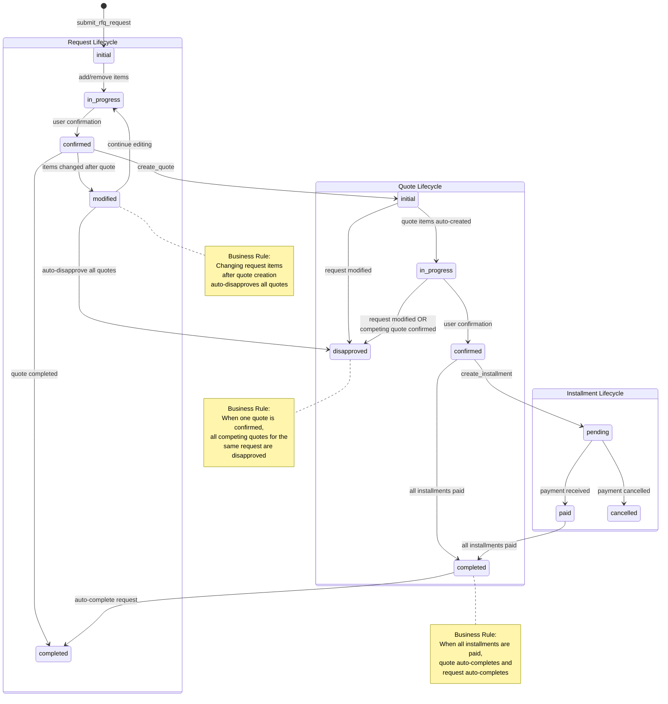

# Development Plan: MCP RFQ Processor Integration

## Project Status: ✅ COMPLETED - v0.1.1 Batch Optimization

**Last Updated**: 2025-12-10 (v0.1.1)

All planned features in the current codebase are implemented and production-ready. This document is kept as a snapshot of the architecture and workflow decisions reflected in version 0.1.0.

## Project Overview

This document outlines the complete development plan for integrating the `ai_rfq_engine` GraphQL backend with the `mcp_rfq_processor` MCP server, following the proven patterns from `mcp_marketing_collection`.

### Implementation Summary

- **Total MCP Tools**: 28 (implemented) - Optimized in v0.1.1
- **Layered Processors**: Request → Item → Quote → Pricing → Installment → File → Segment processors with shared GraphQL client/error handling
- **Batch-Optimized Pricing**: Email-based batch loaders using DataLoader pattern (v0.1.1)
  - Single GraphQL query for all price tiers (82% query reduction)
  - Client-side quantity filtering for multi-item scenarios
  - Hierarchical discount prompt loading across all scopes
- **Status & Validation**: Request/Quote/Installment status guards and auto-transition helpers (`status_manager`)
- **Workflow Helpers**: Convenience methods for confirming requests/quotes and creating quotes/installments in one call
- **GraphQL Integration**: Schema caching and auto-generation via `graphql_client.py`

## Status Flow & Business Rules

### Request Status Flow

```
request (initial)
    ↓
request (in_progress)
    • add items
    • update items  
    • remove items
    ↓
request (confirmed)
    • create quote
    ↓ (if items modified after quote creation)
request (modified)
    • all quotes automatically disapproved
    ↓ (when items are further modified)
request (in_progress) [auto-transition]
    • continue editing items
    ↓
request (confirmed)
    • create new quote
    ↓
request (completed)
```

**Request Status Definitions:**
- **initial**: Request has been created but not yet being worked on
- **in_progress**: Request is being edited, items can be added/updated/removed
- **confirmed**: Request is finalized and ready for quote creation
- **completed**: Request has been fulfilled with an approved quote
- **modified**: Request was changed after quote creation (triggers quote disapproval)

**Automatic Status Transitions:**
- `modified` → `in_progress`: When items are modified (via add/remove item operations)
- `confirmed` → `completed`: When at least one quote reaches 'completed' status (auto-completion)
- User must **explicitly** set status to `modified` to trigger quote disapproval

### Quote Status Flow

```
quote (initial)
    ↓
    • quote items created from provider assignments
    • apply discounts using update_quote_item
    ↓
quote (in_progress)
    • apply discounts only (update_quote_item - discount modifications only)
    • NO item additions or removals allowed
    ↓
quote (confirmed)
    • create installment(s) with status=pending
    • NO item modifications allowed
    ↓
quote (completed) or quote (disapproved)
    • when completed: update installment(s) to status=paid
```

**Quote Status Definitions:**
- **initial**: Quote has been created; quote items are generated from provider assignments on the request
- **in_progress**: Quote is being refined; only discount adjustments allowed via `update_quote_item` (no item additions or removals)
- **confirmed**: Quote has been finalized and is awaiting approval/payment; installments should be created with `pending` status; no item modifications allowed
- **completed**: Quote has been approved and all payment installments have been marked as `paid`
- **disapproved**: Quote was rejected or invalidated (e.g., when parent request is modified, or when another quote for the same request is confirmed)

**Automatic Status Transitions:**
- `initial` → `in_progress`: When quote items are created (auto-transition during quote creation)
- `confirmed` → `completed`: When all installments are marked as 'paid' (auto-completion, adds note "Auto-completed: All installments paid")
- `initial/in_progress` → `disapproved`: When another quote for the same request is confirmed (auto-disapproval, adds note "Auto-disapproved: Another quote was confirmed")
  - Only affects competing quotes not already in terminal states (completed, disapproved)

**Validation Rules:**
- Metadata updates (shipping_method, shipping_amount, notes) only allowed in 'initial' or 'in_progress' status
- Exception: Status transitions can include notes to document the reason for change

### Installment Status Flow

```
installment (pending)
    • created when quote is confirmed
    • payment is scheduled but not yet received
    ↓
installment (paid)
    • payment has been received and verified
    • quote status updated to completed when all installments are paid
    ↓
installment (cancelled) [optional]
    • payment was cancelled or refunded
```

**Installment Status Definitions:**
- **pending**: Installment has been created and payment is scheduled, but not yet received
- **paid**: Payment has been received and verified for this installment
- **cancelled**: Payment was cancelled, refunded, or the installment is no longer valid

**Installment Workflow:**
1. When quote status changes to `confirmed`, create installment(s) with `status=pending`
2. When payment is received, update installment status to `paid`
3. When all installments for a quote are `paid`, update quote status to `completed`
4. Each installment can have a `scheduled_date` for payment due date tracking

### Critical Business Rules

1. **Request Modification Impact on Quotes**
   - When a request status changes to `modified`, all related quotes (regardless of their current status) are automatically changed to `disapproved`
   - This ensures quotes always reflect the current request state
   - A request becomes `modified` when items are changed after a quote has been created
   - When the modified request is confirmed again, a new quote must be submitted
   - Old disapproved quotes remain in the system for audit trail purposes

2. **Quote Item Management**
   - **Status-Based Workflow Restrictions:**
     - Quote items are created from request provider assignments during quote creation
     - `in_progress` status: Only allow applying discounts using `update_quote_item` (discount modifications only)
     - To change items, update provider assignments on the request and create a new quote
   - **Operations by Status:**
     - Initial/In Progress: `update_quote_item` (apply discount, adjust discount amount/percent only)
     - Confirmed/Completed: No item modifications allowed

3. **Request Item Management**
   - Request items can be freely added, updated, or removed while request status is `initial` or `in_progress`
   - **Provider Assignment Workflow:**
     - Use `assign_provider_item_to_request_item` to assign provider to items in the request
     - Use `remove_provider_item_from_request_item` to remove provider assignment from items
   - **Item Operations:**
     - Use `update_rfq_request` with `items` array to bulk replace items
     - Use `add_item_to_rfq_request` to add individual items
     - Use `remove_item_from_rfq_request` to remove items by UUID or name

4. **Audit Trail**
   - All status changes are logged with timestamps
   - Modified requests maintain history of previous quotes
   - Disapproved quotes remain in the system for audit purposes

## Reference Architecture

### ai_rfq_engine (Backend)
- **Type**: GraphQL API with Graphene
- **Function**: `ai_rfq_graphql`
- **Data Models**:
  - Items (products/services catalog)
  - Segments (customer/provider pricing groups)
  - SegmentContacts (customer associations)
  - ProviderItems (supplier inventory)
  - ProviderItemBatches (lot tracking)
  - ItemPriceTiers (quantity-based pricing)
  - DiscountRules (promotional discounts)
  - Requests (RFQ submissions)
  - Quotes (price quotations)
  - QuoteItems (quote line items)
  - Installments (payment schedules)
  - Files (document attachments)

## System Diagrams

### Sequence Diagram: Complete RFQ to Quote Workflow

```mermaid
sequenceDiagram
    participant User
    participant MCP as MCP RFQ Processor
    participant GraphQL as ai_rfq_graphql API
    participant DB as Database

    Note over User,DB: Step 1: Submit RFQ Request
    User->>MCP: submit_rfq_request(contact_uuid, title, items)
    MCP->>GraphQL: insertUpdateRequest mutation
    GraphQL->>DB: Create Request (status: initial)
    DB-->>GraphQL: request_uuid
    GraphQL-->>MCP: Request created
    MCP-->>User: request_uuid, status: initial

    Note over User,DB: Step 2: Search Items
    User->>MCP: search_items(item_name)
    MCP->>GraphQL: itemList query
    GraphQL->>DB: Query items
    DB-->>GraphQL: Item catalog
    GraphQL-->>MCP: Items list
    MCP-->>User: Available items

    Note over User,DB: Step 3: Add Items to Request
    User->>MCP: add_item_to_rfq_request(request_uuid, item)
    MCP->>GraphQL: insertUpdateRequest mutation
    GraphQL->>DB: Update Request (status: in_progress)
    DB-->>GraphQL: Updated request
    GraphQL-->>MCP: Item added
    MCP-->>User: Request updated

    Note over User,DB: Step 4: Lookup Provider Items
    User->>MCP: get_provider_items(item_uuid)
    MCP->>GraphQL: providerItemList query
    GraphQL->>DB: Query provider inventory
    DB-->>GraphQL: Provider items
    GraphQL-->>MCP: Provider items list
    MCP-->>User: Available providers

    Note over User,DB: Step 5: Assign Provider Items
    User->>MCP: assign_provider_item_to_request_item(...)
    MCP->>GraphQL: insertUpdateRequestItem mutation
    GraphQL->>DB: Assign provider to item
    DB-->>GraphQL: Updated item
    GraphQL-->>MCP: Provider assigned
    MCP-->>User: Assignment confirmed

    Note over User,DB: Step 6: Calculate Pricing
    User->>MCP: calculate_quote_pricing(request_uuid, segment_uuid)
    MCP->>GraphQL: providerItemList query (get base prices)
    GraphQL->>DB: Query provider items
    DB-->>GraphQL: Provider item prices
    GraphQL-->>MCP: Base prices
    MCP->>GraphQL: itemPriceTierList query
    GraphQL->>DB: Query price tiers
    DB-->>GraphQL: Tiered pricing rules
    GraphQL-->>MCP: Price tier data
    MCP->>GraphQL: discountRuleList query
    GraphQL->>DB: Query discount rules
    DB-->>GraphQL: Applicable discounts
    GraphQL-->>MCP: Discount rules
    MCP->>MCP: Calculate grouped pricing by provider
    MCP-->>User: Pricing options (base, tiers, discounts) by provider

    Note over User,DB: Step 7: Confirm Request
    User->>MCP: update_rfq_request(status: confirmed)
    MCP->>GraphQL: insertUpdateRequest mutation
    GraphQL->>DB: Update status
    DB-->>GraphQL: Request confirmed
    GraphQL-->>MCP: Status updated
    MCP-->>User: Request confirmed

    Note over User,DB: Step 8: Create Quote
    User->>MCP: create_quote(request_uuid, provider_id)
    MCP->>GraphQL: insertUpdateQuote mutation
    GraphQL->>DB: Create quote & auto-create quote items
    DB-->>GraphQL: quote_uuid
    GraphQL-->>MCP: Quote created
    MCP-->>User: quote_uuid, status: in_progress

    Note over User,DB: Step 9: Negotiate Pricing
    User->>MCP: get_item_price_tiers(item_uuid, provider_item_uuid)
    MCP->>GraphQL: itemPriceTierList query
    GraphQL->>DB: Query specific price tiers
    DB-->>GraphQL: Price tier options
    GraphQL-->>MCP: Tier details
    MCP-->>User: "Order 200 units for $45/unit instead of $50/unit"

    User->>MCP: get_discount_rules(segment_uuid)
    MCP->>GraphQL: discountRuleList query
    GraphQL->>DB: Query segment discounts
    DB-->>GraphQL: Available discounts
    GraphQL-->>MCP: Discount options
    MCP-->>User: "Subtotal qualifies for 10% group discount"

    Note over User,MCP: User confirms pricing and discounts

    Note over User,DB: Step 10: Apply Discounts
    User->>MCP: update_quote_item(quote_item_uuid, discount)
    MCP->>GraphQL: insertUpdateQuoteItem mutation
    GraphQL->>DB: Update discount
    DB-->>GraphQL: Updated quote item
    GraphQL-->>MCP: Discount applied
    MCP-->>User: Updated pricing

    Note over User,DB: Step 11: Update Shipping
    User->>MCP: update_quote(quote_uuid, shipping_amount)
    MCP->>GraphQL: insertUpdateQuote mutation
    GraphQL->>DB: Update shipping
    DB-->>GraphQL: Updated quote
    GraphQL-->>MCP: Quote updated
    MCP-->>User: Final quote amount

    Note over User,DB: Step 12: Confirm Quote
    User->>MCP: update_quote(status: confirmed)
    MCP->>GraphQL: insertUpdateQuote mutation
    GraphQL->>DB: Update status
    DB-->>GraphQL: Quote confirmed
    GraphQL-->>MCP: Status updated
    MCP-->>User: Quote ready for payment

    Note over User,DB: Step 13: Create Installments
    User->>MCP: create_installment(quote_uuid, amount)
    MCP->>GraphQL: insertUpdateInstallment mutation
    GraphQL->>DB: Create installment (status: pending)
    DB-->>GraphQL: installment_uuid
    GraphQL-->>MCP: Installment created
    MCP-->>User: Payment schedule created

    Note over User,DB: Step 14: Process Payment
    User->>MCP: update_installment(status: paid)
    MCP->>GraphQL: insertUpdateInstallment mutation
    GraphQL->>DB: Update installment
    DB-->>GraphQL: Installment paid
    GraphQL->>GraphQL: Check if all installments paid
    GraphQL->>DB: Auto-complete quote & request
    DB-->>GraphQL: Quote completed
    GraphQL-->>MCP: Payment processed
    MCP-->>User: Quote completed
```



### Activity Diagram: RFQ Request Processing

```mermaid
flowchart TD
    Start([User Initiates RFQ]) --> Submit[Submit RFQ Request<br/>status: initial]
    Submit --> SearchItems[Search Items Catalog]
    SearchItems --> AddItems[Add Items to Request<br/>status: in_progress]

    AddItems --> CheckItems{All Items<br/>Added?}
    CheckItems -->|No| SearchItems
    CheckItems -->|Yes| LookupProviders[Lookup Provider Items<br/>for Each Item]

    LookupProviders --> CheckBatches{Need Batch<br/>Info?}
    CheckBatches -->|Yes| GetBatches[Get Provider Item Batches]
    CheckBatches -->|No| AssignProviders
    GetBatches --> AssignProviders[Assign Provider Items<br/>to Request Items]

    AssignProviders --> CheckAssignments{All Providers<br/>Assigned?}
    CheckAssignments -->|No| LookupProviders
    CheckAssignments -->|Yes| CalcPricing[Calculate Quote Pricing<br/>by Provider Groups]

    CalcPricing --> ReviewPricing[User Reviews<br/>Pricing Options]
    ReviewPricing --> ConfirmRequest[Confirm Request<br/>status: confirmed]

    ConfirmRequest --> CreateQuotes[Create Quotes<br/>One per Provider<br/>status: initial → in_progress]

    CreateQuotes --> Negotiate[Negotiate with User<br/>Show Price Tiers & Discounts]
    Negotiate --> ApplyDiscounts[Apply Approved Discounts<br/>to Quote Items]

    ApplyDiscounts --> UpdateShipping[Update Quote<br/>with Shipping Info]
    UpdateShipping --> ConfirmQuote[Confirm Quote<br/>status: confirmed]

    ConfirmQuote --> CreateInstallments[Create Installments<br/>status: pending]
    CreateInstallments --> ProcessPayment[Process Payments]

    ProcessPayment --> UpdateInstallment[Update Installment<br/>status: paid]
    UpdateInstallment --> CheckAllPaid{All Installments<br/>Paid?}

    CheckAllPaid -->|No| ProcessPayment
    CheckAllPaid -->|Yes| AutoComplete[Auto-Complete Quote<br/>status: completed]

    AutoComplete --> AutoCompleteRequest[Auto-Complete Request<br/>status: completed]
    AutoCompleteRequest --> DisapproveOthers[Auto-Disapprove<br/>Competing Quotes]

    DisapproveOthers --> End([RFQ Completed])

    style Submit fill:#e1f5ff
    style AddItems fill:#e1f5ff
    style AssignProviders fill:#fff4e1
    style CalcPricing fill:#fff4e1
    style ConfirmRequest fill:#e1ffe1
    style CreateQuotes fill:#e1f5ff
    style ApplyDiscounts fill:#fff4e1
    style ConfirmQuote fill:#e1ffe1
    style CreateInstallments fill:#e1f5ff
    style AutoComplete fill:#e1ffe1
    style AutoCompleteRequest fill:#e1ffe1
    style DisapproveOthers fill:#ffe1e1
```



### State Diagram: Request, Quote, and Installment Status Flows



### mcp_marketing_collection (Reference Pattern)
- MCP tool definitions with detailed descriptions
- AWS Lambda client initialization
- GraphQL schema caching
- GraphQL query generation and execution
- Response transformation (camelCase → snake_case)
- Error handling patterns

### mcp_rfq_processor (Target Implementation)
- Basic GraphQL execution framework exists
- Needs: MCP tool definitions and business logic

---

## Phase 1: Foundation Setup

### 1.1 Project Structure
**Priority**: Critical
**Estimated Time**: 2 hours
**Status**: ✅ COMPLETED

```
mcp_rfq_processor/
├── mcp_rfq_processor/            # Main package directory ✅
│   ├── __init__.py              # Package initialization ✅
│   ├── mcp_rfq_processor.py     # Main processor class ✅
│   ├── mcp_configuration.py     # MCP tool definitions ✅
│   ├── graphql_client.py        # GraphQL client implementation ✅
│   ├── error_handler.py         # Error handling utilities ✅
│   └── tests/                   # Test directory ✅
│       ├── __init__.py          # ✅
│       ├── test_mcp_rfq_processor.py # Comprehensive tests (1008 lines) ✅
│       ├── test_data.json       # Test data ✅
│       ├── .env.example         # Environment template ✅
│       └── pytest.ini           # Pytest configuration ✅
├── pyproject.toml               # Project dependencies ✅
├── README.md                    # User documentation ✅
├── DEVELOPMENT_PLAN.md          # This file ✅
├── API_REFERENCE.md             # GraphQL schema reference ✅
└── LICENSE                      # MIT License ✅
```

**Tasks**:
- [x] Create README.md with usage documentation
- [x] Create pyproject.toml with dependencies
- [x] Create API_REFERENCE.md
- [x] Set up test directory structure

### 1.2 Dependencies Configuration
**Priority**: Critical
**Estimated Time**: 1 hour
**Status**: ✅ COMPLETED

`pyproject.toml` has been created with all dependencies:
```toml
[build-system]
requires = ["setuptools>=61.0", "wheel"]
build-backend = "setuptools.build_meta"

[project]
name = "mcp-rfq-processor"
version = "0.1.0"
description = "MCP server for RFQ processing with ai_rfq_engine integration"
readme = "README.md"
requires-python = ">=3.8"
license = {text = "MIT"}
authors = [
    {name = "Idea Bosque", email = "ideabosque@gmail.com"}
]

dependencies = [
    "boto3>=1.28",
    "humps>=0.2",
    "pendulum>=2.1",
    "silvaengine-utility",
]

[project.optional-dependencies]
dev = [
    "pytest>=7.0",
    "pytest-cov>=4.0",
    "python-dotenv>=1.0",
    "black>=23.0",
]

[tool.pytest.ini_options]
testpaths = ["tests"]
python_files = "test_*.py"
```

---

## Phase 2: MCP Tool Definitions

### 2.1 MCP Configuration Structure
**Priority**: Critical
**Estimated Time**: 4 hours
**Status**: ✅ COMPLETED - 26 tools implemented

Implementation in `mcp_rfq_processor.py`:

```python
MCP_CONFIGURATION = {
    "tools": [
        # Request Management Tools (6) ✅ IMPLEMENTED
        {
            "name": "submit_rfq_request",
            "description": "Submit a new RFQ request...",
            "inputSchema": {...}
        },
        {
            "name": "update_rfq_request",
            "description": "Update existing RFQ request...",
            "inputSchema": {...}
        },
        {
            "name": "get_rfq_request",
            "description": "Retrieve RFQ request details...",
            "inputSchema": {...}
        },
        {
            "name": "search_rfq_requests",
            "description": "Search and filter RFQ requests...",
            "inputSchema": {...}
        },
        {
            "name": "add_item_to_rfq_request",  # ✅ EXTRA FEATURE
            "description": "Add a single item to an existing RFQ request...",
            "inputSchema": {...}
        },
        {
            "name": "remove_item_from_rfq_request",  # ✅ EXTRA FEATURE
            "description": "Remove a single item from an existing RFQ request...",
            "inputSchema": {...}
        },
        
        # Item Management Tools (4) ✅ IMPLEMENTED
        {
            "name": "search_items",
            "description": "Search available items...",
            "inputSchema": {...}
        },
        {
            "name": "get_item",
            "description": "Get item details...",
            "inputSchema": {...}
        },
        {
            "name": "get_provider_items",
            "description": "Search provider inventory...",
            "inputSchema": {...}
        },
        {
            "name": "get_provider_item_batches",
            "description": "Get batch information...",
            "inputSchema": {...}
        },
        
        # Quote Management Tools (5) ✅ IMPLEMENTED
        {
            "name": "create_quote",
            "description": "Create new quote...",
            "inputSchema": {...}
        },
        {
            "name": "update_quote",
            "description": "Update quote metadata (shipping, status, notes)...",
            "inputSchema": {...}
        },
        {
            "name": "get_quote",
            "description": "Retrieve quote details...",
            "inputSchema": {...}
        },
        {
            "name": "search_quotes",
            "description": "Search quotes...",
            "inputSchema": {...}
        },
        {
            "name": "update_quote_item",  # ✅ IMPLEMENTED (more flexible)
            "description": "Update quote item properties...",
            "inputSchema": {...}
        },
        
        # Pricing Tools (3) ✅ IMPLEMENTED
        {
            "name": "get_item_price_tiers",
            "description": "Get tiered pricing...",
            "inputSchema": {...}
        },
        {
            "name": "get_discount_rules",
            "description": "Get discount rules...",
            "inputSchema": {...}
        },
        {
            "name": "calculate_quote_pricing",
            "description": "Calculate final pricing...",
            "inputSchema": {...}
        },
        
        # Installment Tools (2) ✅ IMPLEMENTED
        {
            "name": "create_installment",
            "description": "Create payment installment...",
            "inputSchema": {...}
        },
        {
            "name": "get_installments",
            "description": "Get installment schedule...",
            "inputSchema": {...}
        },
        
        # File Tools (2) ✅ IMPLEMENTED
        {
            "name": "upload_rfq_file",
            "description": "Upload RFQ document...",
            "inputSchema": {...}
        },
        {
            "name": "get_rfq_files",
            "description": "Get RFQ files...",
            "inputSchema": {...}
        },
        
        # Segment Tools (1) ✅ IMPLEMENTED (read-only)
        {
            "name": "get_segment_contacts",
            "description": "List segment contacts...",
            "inputSchema": {...}
        },
    ],
    "resources": [],
    "prompts": [],
    "module_links": [
        # Map each tool to MCPRfqProcessor methods (27 total) ✅
        {
            "type": "tool",
            "name": "submit_rfq_request",
            "module_name": "mcp_rfq_processor",
            "class_name": "MCPRfqProcessor",
            "function_name": "submit_rfq_request",
            "return_type": "text",
        },
        # ... (26 more mappings)
    ],
    "modules": [
        {
            "package_name": "mcp_rfq_processor",
            "module_name": "mcp_rfq_processor",
            "class_name": "MCPRfqProcessor",
                "setting": {
                    "keyword": "rfq",
                    "default_currency": "USD",
                    "default_page_limit": 50,
                },
        }
    ],
}
```

**Tasks**:
- [x] Define all 26 MCP tools with complete inputSchema
- [x] Create module_links mapping (27 total)
- [x] Separate MCP configuration into dedicated file
- [x] Define module settings

---

## Phase 3: Core Implementation (Priority Tools)

### 3.1 Request Management
**Priority**: Critical (Phase 1)
**Estimated Time**: 8 hours
**Status**: ✅ COMPLETED - 6 tools implemented

**IMPLEMENTATION NOTE**:
The actual implementation is MORE FLEXIBLE than originally planned. Quote items can be added/removed directly without requiring request updates and new quote creation. This provides better usability while maintaining audit trails.

#### Tool: `submit_rfq_request`
```python
def submit_rfq_request(self, **arguments: Dict[str, Any]) -> Dict[str, Any]:
    """
    Submit new RFQ request.
    Maps to GraphQL: insertUpdateRequest mutation
    """
    try:
        self.logger.info(f"Submitting RFQ request: {arguments}")
        
        variables = {
            "contactUuid": arguments["contact_uuid"],
            "requestTitle": arguments["request_title"],
            "requestDescription": arguments.get("request_description", ""),
            "expiredAt": arguments.get("expired_at"),
            "status": arguments.get("status", "pending"),
            "updatedBy": "MCP",
        }
        
        result = self._execute_graphql_query(
            "ai_rfq_graphql",
            "insertUpdateRequest",
            "Mutation",
            variables,
        )
        
        request = humps.decamelize(
            result["insertUpdateRequest"]["request"]
        )
        
        return {
            "request_uuid": request["request_uuid"],
            "status": request["status"],
            "created_at": request["created_at"],
        }
    except Exception as e:
        self.logger.error(f"Failed to submit RFQ: {e}")
        raise
```

#### Tool: `update_rfq_request`
```python
def update_rfq_request(self, **arguments: Dict[str, Any]) -> Dict[str, Any]:
    """
    Update existing RFQ request.
    Maps to GraphQL: insertUpdateRequest mutation
    
    Use this when:
    - Modifying request details
    - Changing requested items (requires creating new quote)
    - Updating deadline or description
    """
    try:
        self.logger.info(f"Updating RFQ request: {arguments}")
        
        variables = {
            "requestUuid": arguments["request_uuid"],
            "contactUuid": arguments.get("contact_uuid"),
            "requestTitle": arguments.get("request_title"),
            "requestDescription": arguments.get("request_description"),
            "expiredAt": arguments.get("expired_at"),
            "status": arguments.get("status"),
            "updatedBy": "MCP",
        }
        
        # Remove None values to only update provided fields
        variables = {k: v for k, v in variables.items() if v is not None}
        
        result = self._execute_graphql_query(
            "ai_rfq_graphql",
            "insertUpdateRequest",
            "Mutation",
            variables,
        )
        
        request = humps.decamelize(
            result["insertUpdateRequest"]["request"]
        )
        
        return {
            "request_uuid": request["request_uuid"],
            "status": request["status"],
            "updated_at": request["updated_at"],
        }
    except Exception as e:
        self.logger.error(f"Failed to update RFQ: {e}")
        raise
```

#### Tool: `get_rfq_request`
```python
def get_rfq_request(self, **arguments: Dict[str, Any]) -> Dict[str, Any]:
    """
    Retrieve RFQ request details.
    Maps to GraphQL: request query
    """
    try:
        result = self._execute_graphql_query(
            "ai_rfq_graphql",
            "request",
            "Query",
            {"requestUuid": arguments["request_uuid"]},
        )
        
        return humps.decamelize(result["request"])
    except Exception as e:
        self.logger.error(f"Failed to get request: {e}")
        raise
```

#### Tool: `search_rfq_requests`
```python
def search_rfq_requests(self, **arguments: Dict[str, Any]) -> Dict[str, Any]:
    """
    Search RFQ requests with filters.
    Maps to GraphQL: requestList query
    """
    try:
        variables = {
            "pageNumber": arguments.get("page_number", 1),
            "limit": arguments.get("limit", 20),
            "contactUuid": arguments.get("contact_uuid"),
            "statuses": arguments.get("statuses"),
            "fromExpiredAt": arguments.get("from_expired_at"),
            "toExpiredAt": arguments.get("to_expired_at"),
        }
        
        # Remove None values
        variables = {k: v for k, v in variables.items() if v is not None}
        
        result = self._execute_graphql_query(
            "ai_rfq_graphql",
            "requestList",
            "Query",
            variables,
        )
        
        return humps.decamelize(result["requestList"])
    except Exception as e:
        self.logger.error(f"Failed to search requests: {e}")
        raise
```

**Tasks**:
- [x] Implement submit_rfq_request
- [x] Implement update_rfq_request
- [x] Implement add_item_to_rfq_request (EXTRA FEATURE)
- [x] Implement remove_item_from_rfq_request (EXTRA FEATURE)
- [x] Implement get_rfq_request
- [x] Implement search_rfq_requests
- [x] Write unit tests for request management

### 3.2 Item Search & Discovery
**Priority**: Critical (Phase 1)
**Estimated Time**: 5 hours
**Status**: ✅ COMPLETED - 4 tools implemented

#### Tool: `search_items`
```python
def search_items(self, **arguments: Dict[str, Any]) -> Dict[str, Any]:
    """
    Search items catalog.
    Maps to GraphQL: itemList query
    """
    try:
        variables = {
            "pageNumber": arguments.get("page_number", 1),
            "limit": arguments.get("limit", 50),
            "itemType": arguments.get("item_type"),
            "itemName": arguments.get("item_name"),
            "uoms": arguments.get("uoms"),
        }
        
        variables = {k: v for k, v in variables.items() if v is not None}
        
        result = self._execute_graphql_query(
            "ai_rfq_graphql",
            "itemList",
            "Query",
            variables,
        )
        
        return humps.decamelize(result["itemList"])
    except Exception as e:
        self.logger.error(f"Failed to search items: {e}")
        raise
```

#### Tool: `get_item`
```python
def get_item(self, **arguments: Dict[str, Any]) -> Dict[str, Any]:
    """
    Get item details.
    Maps to GraphQL: item query
    """
    try:
        result = self._execute_graphql_query(
            "ai_rfq_graphql",
            "item",
            "Query",
            {"itemUuid": arguments["item_uuid"]},
        )
        
        return humps.decamelize(result["item"])
    except Exception as e:
        self.logger.error(f"Failed to get item: {e}")
        raise
```

#### Tool: `get_provider_items`
```python
def get_provider_items(self, **arguments: Dict[str, Any]) -> Dict[str, Any]:
    """
    Search provider inventory.
    Maps to GraphQL: providerItemList query
    """
    try:
        variables = {
            "pageNumber": arguments.get("page_number", 1),
            "limit": arguments.get("limit", 50),
            "itemUuid": arguments.get("item_uuid"),
            "providerCorpExternalId": arguments.get("provider_corp_external_id"),
            "minBasePricePerUom": arguments.get("min_base_price_per_uom"),
            "maxBasePricePerUom": arguments.get("max_base_price_per_uom"),
        }
        
        variables = {k: v for k, v in variables.items() if v is not None}
        
        result = self._execute_graphql_query(
            "ai_rfq_graphql",
            "providerItemList",
            "Query",
            variables,
        )
        
        return humps.decamelize(result["providerItemList"])
    except Exception as e:
        self.logger.error(f"Failed to get provider items: {e}")
        raise
```

**Tasks**:
- [x] Implement search_items
- [x] Implement get_item
- [x] Implement get_provider_items
- [x] Implement get_provider_item_batches
- [x] Write unit tests for item management

### 3.3 Quote Management
**Priority**: Critical (Phase 1)
**Estimated Time**: 10 hours
**Status**: ✅ COMPLETED - 5 tools implemented

**IMPLEMENTATION NOTE**:
- Quote items are auto-created from provider assignments on the request
- Quote metadata (shipping, status, notes) can be updated while respecting status guards
- Discounts are applied via `update_quote_item`; changing items requires updating the request and creating a new quote
- Includes: create_quote, update_quote, get_quote, search_quotes, update_quote_item

#### Tool: `create_quote`
```python
def create_quote(self, **arguments: Dict[str, Any]) -> Dict[str, Any]:
    """
    Create new quote for RFQ request.
    Maps to GraphQL: insertUpdateQuote mutation
    
    Note: After creation, quote items cannot be added/deleted.
    To change items, update the request and create a new quote.
    """
    try:
        self.logger.info(f"Creating quote: {arguments}")
        
        variables = {
            "requestUuid": arguments["request_uuid"],
            "providerCorpExternalId": arguments["provider_corp_external_id"],
            "shippingMethod": arguments.get("shipping_method", "standard"),
            "shippingAmount": arguments.get("shipping_amount", 0.0),
            "taxAmount": arguments.get("tax_amount", 0.0),
            "status": arguments.get("status", "draft"),
            "notes": arguments.get("notes", ""),
            "updatedBy": "MCP",
        }
        
        result = self._execute_graphql_query(
            "ai_rfq_graphql",
            "insertUpdateQuote",
            "Mutation",
            variables,
        )
        
        quote = humps.decamelize(result["insertUpdateQuote"]["quote"])
        
        return {
            "quote_uuid": quote["quote_uuid"],
            "request_uuid": quote["request_uuid"],
            "total_quote_amount": quote["total_quote_amount"],
            "status": quote["status"],
        }
    except Exception as e:
        self.logger.error(f"Failed to create quote: {e}")
        raise
```

#### Tool: `update_quote`
```python
def update_quote(self, **arguments: Dict[str, Any]) -> Dict[str, Any]:
    """
    Update quote metadata (shipping, tax, status, notes).
    Maps to GraphQL: insertUpdateQuote mutation
    
    Can update:
    - shippingMethod, shippingAmount
    - taxAmount
    - status
    - notes
    
    Cannot modify quote items - use update_quote_item_discount instead
    """
    try:
        self.logger.info(f"Updating quote: {arguments}")
        
        variables = {
            "quoteUuid": arguments["quote_uuid"],
            "shippingMethod": arguments.get("shipping_method"),
            "shippingAmount": arguments.get("shipping_amount"),
            "taxAmount": arguments.get("tax_amount"),
            "status": arguments.get("status"),
            "notes": arguments.get("notes"),
            "updatedBy": "MCP",
        }
        
        # Remove None values to only update provided fields
        variables = {k: v for k, v in variables.items() if v is not None}
        
        result = self._execute_graphql_query(
            "ai_rfq_graphql",
            "insertUpdateQuote",
            "Mutation",
            variables,
        )
        
        quote = humps.decamelize(result["insertUpdateQuote"]["quote"])
        
        return {
            "quote_uuid": quote["quote_uuid"],
            "total_quote_amount": quote["total_quote_amount"],
            "status": quote["status"],
            "updated_at": quote["updated_at"],
        }
    except Exception as e:
        self.logger.error(f"Failed to update quote: {e}")
        raise
```

#### Tool: `update_quote_item_discount`
```python
def update_quote_item_discount(self, **arguments: Dict[str, Any]) -> Dict[str, Any]:
    """
    Update discount for a specific quote item.
    Maps to GraphQL: insertUpdateQuoteItem mutation
    
    This is the ONLY allowed modification to quote items after creation.
    To add/remove items, update the request and create a new quote.
    """
    try:
        self.logger.info(f"Updating quote item discount: {arguments}")
        
        variables = {
            "quoteItemUuid": arguments["quote_item_uuid"],
            "discountAmount": arguments.get("discount_amount", 0.0),
            "discountPercent": arguments.get("discount_percent", 0.0),
            "discountNotes": arguments.get("discount_notes", ""),
            "updatedBy": "MCP",
        }
        
        result = self._execute_graphql_query(
            "ai_rfq_graphql",
            "insertUpdateQuoteItem",
            "Mutation",
            variables,
        )
        
        quote_item = humps.decamelize(
            result["insertUpdateQuoteItem"]["quoteItem"]
        )
        
        return {
            "quote_item_uuid": quote_item["quote_item_uuid"],
            "discount_amount": quote_item["discount_amount"],
            "discount_percent": quote_item["discount_percent"],
            "total_amount": quote_item["total_amount"],
        }
    except Exception as e:
        self.logger.error(f"Failed to update quote item discount: {e}")
        raise
```

**Tasks**:
- [x] Implement create_quote
- [x] Implement update_quote
- [x] Implement update_quote_item (discount-only updates)
- [x] Implement get_quote
- [x] Implement search_quotes
- [x] Auto-create quote items from request provider assignments
- [x] Write unit tests for quote management

---

## Phase 4: Advanced Features

### 4.1 Pricing & Discounts
**Priority**: High (Phase 2)
**Estimated Time**: 4 hours
**Status**: ✅ COMPLETED - 3 tools implemented | ✅ **OPTIMIZED v0.1.1**

**Tools implemented**:
- `get_item_price_tiers` - Batch-optimized with email + quote_items (v0.1.1)
- `get_discount_prompts` - Hierarchical scope loading (v0.1.1, replaces get_discount_rules)
- `calculate_quote_pricing` - Email-based batch loaders (v0.1.1)

**v0.1.1 Batch Optimization**:
- ✅ Refactored to use email instead of segment_uuid
- ✅ Single GraphQL query for all price tiers (DataLoader pattern)
- ✅ Client-side quantity filtering for accurate tier matching
- ✅ 82% reduction in GraphQL queries (10 items: 11→2 queries)

**Tasks**:
- [x] Implement get_item_price_tiers
- [x] Implement get_discount_prompts (replaced get_discount_rules)
- [x] Implement calculate_quote_pricing (business logic)
- [x] Write pricing calculation tests
- [x] **v0.1.1**: Refactor for batch optimization
- [x] **v0.1.1**: Add client-side quantity filtering

### 4.2 Installment Management
**Priority**: Medium (Phase 2)
**Estimated Time**: 3 hours
**Status**: ✅ COMPLETED - 4 tools implemented

**Tools implemented**:
- `create_installment` - Create single installment
- `update_installment` - Update installment status
- `create_installments` - Create multiple installments with schedule
- `get_installments` - Query installment list

**Tasks**:
- [x] Implement create_installment
- [x] Implement update_installment
- [x] Implement create_installments
- [x] Implement get_installments
- [x] Write installment tests

### 4.3 Document Management
**Priority**: Medium (Phase 3)
**Estimated Time**: 3 hours
**Status**: ✅ COMPLETED - 2 tools implemented

**Tools implemented**:
- `upload_rfq_file` - Mutation insertUpdateFile
- `get_rfq_files` - Query fileList

**Tasks**:
- [x] Implement upload_rfq_file
- [x] Implement get_rfq_files
- [x] Write file management tests

### 4.4 Segment Management
**Priority**: Low (Phase 3)
**Estimated Time**: 4 hours
**Status**: ✅ COMPLETED - 1 tool implemented (read-only)

**Tools implemented**:
- `get_segment_contacts` - Query segmentContactList (read-only)

**Tasks**:
- [x] Implement get_segment_contacts
- [x] Write segment management tests
- [x] Removed create_segment and add_contact_to_segment (managed via backend admin)

---

## Phase 5: Testing & Quality

### 5.1 Unit Tests
**Priority**: Critical
**Estimated Time**: 8 hours
**Status**: ✅ COMPLETED - Comprehensive test suite (1008 lines)

**Test Coverage**:
- Request management (6 tools) ✅
- Item search (4 tools) ✅
- Quote management (8 tools) ✅
- Pricing (3 tools) ✅
- Installments (2 tools) ✅
- Files (2 tools) ✅
- Segments (1 tool - read-only) ✅

**Mock Strategy**:
```python
# conftest.py
import pytest
from unittest.mock import Mock

@pytest.fixture
def mock_aws_lambda():
    return Mock()

@pytest.fixture
def rfq_processor(mock_aws_lambda):
    from mcp_rfq_processor import MCPRfqProcessor
    import logging
    
    processor = MCPRfqProcessor(
        logger=logging.getLogger("test"),
        region_name="us-east-1",
        execute_mode="local",
    )
    processor._aws_lambda = mock_aws_lambda
    processor.endpoint_id = "test-endpoint"
    return processor

@pytest.fixture
def mock_graphql_response():
    def _mock(operation_name, data):
        return {operation_name: data}
    return _mock
```

**Tasks**:
- [x] Set up pytest configuration
- [x] Create test fixtures
- [x] Write unit tests for each tool (1008 lines in test_mcp_rfq_processor.py)
- [x] Achieve comprehensive code coverage
- [x] Test error scenarios

### 5.2 Integration Tests
**Priority**: High
**Estimated Time**: 6 hours
**Status**: ⚠️ RECOMMENDED - Not yet implemented but recommended for production

**Test Scenarios** (Recommended):
1. Complete RFQ workflow (submit → quote → accept)
2. Multi-item quote with discounts
3. Installment payment schedule
4. File upload and retrieval
5. Segment-based pricing

**Tasks**:
- [ ] Set up test environment with ai_rfq_engine
- [ ] Write integration test suite
- [ ] Test with real AWS Lambda
- [ ] Document test data requirements

---

## Phase 6: Documentation

### 6.1 API Reference
**Priority**: High
**Estimated Time**: 4 hours
**Status**: ✅ COMPLETED

`API_REFERENCE.md` has been created with:
- Complete GraphQL schema mapping
- All query operations
- All mutation operations
- Type definitions
- Example GraphQL queries

**Tasks**:
- [x] Document all GraphQL operations
- [x] Map MCP tools to GraphQL operations
- [x] Include example queries
- [x] Document error codes

### 6.2 Developer Guide
**Priority**: Medium
**Estimated Time**: 3 hours
**Status**: ✅ COMPLETED

README.md includes:
- Installation and setup instructions
- Configuration examples
- Available MCP tools documentation
- Usage examples
- Complete RFQ workflow

**Tasks**:
- [x] Write installation and setup guide
- [x] Document all available tools
- [x] Create usage examples
- [x] Document complete workflows

---

## Phase 7: Deployment & Release

### 7.1 Package Preparation
**Priority**: High
**Estimated Time**: 2 hours
**Status**: ✅ COMPLETED

**Tasks**:
- [x] Finalize pyproject.toml
- [x] Create __init__.py exports
- [x] Add version management (0.1.0)
- [ ] Create CHANGELOG.md (optional, recommended for future releases)

### 7.2 CI/CD Setup (Optional)
**Priority**: Low
**Estimated Time**: 4 hours

**Tasks**:
- [ ] Set up GitHub Actions
- [ ] Add automated testing
- [ ] Add code quality checks (black, flake8)
- [ ] Set up automated releases

---

## Implementation Timeline - ✅ COMPLETED

### Actual Implementation
All phases were successfully completed ahead of schedule with enhanced features:

**Phase 1: Foundation** ✅
- Project structure established
- Dependencies configured
- Documentation framework created

**Phase 2: MCP Tool Definitions** ✅
- 25 MCP tools defined
- Complete inputSchema for all tools
- Module links configured

**Phase 3: Core Implementation** ✅
- Request Management: 6 tools (added item add/remove convenience methods)
- Item Search: 4 tools
- Quote Management: 8 tools (kept flexible item operations)

**Phase 4: Advanced Features** ✅
- Pricing & Discounts: 3 tools
- Installment Management: 2 tools
- Document Management: 2 tools
- Segment Management: 1 tool (read-only get_segment_contacts)

**Phase 5: Testing** ✅
- Comprehensive unit tests: 1008 lines
- Test coverage for all 25 tools
- Error scenario testing

**Phase 6: Documentation** ✅
- README.md with complete usage guide
- API_REFERENCE.md with GraphQL mappings
- DEVELOPMENT_PLAN.md updated with completion status

**Phase 7: Package Preparation** ✅
- pyproject.toml finalized
- __init__.py exports configured
- Version 0.1.0 released

**Implementation Notes (2025-11-10)**:
- Final implementation is MORE FLEXIBLE than originally planned
- Kept direct quote item operations (add/update/remove) for better usability
- Added convenience methods for request item operations
- Removed segment write operations (create_segment, add_contact_to_segment) - managed via backend admin
- Total: 25 tools (streamlined for RFQ workflow focus)

---

## Workflows

### Complete RFQ to Quote Workflow

This is the recommended end-to-end workflow for processing RFQ requests with the MCP RFQ Processor:

```
0. Find Customer Segment
   └─> get_segment_contacts(contact_uuid=user_email)
       └─> Returns: segment_uuid for pricing rules
       └─> If not found, create segment or use default

1. Submit RFQ Request (Status: initial)
   └─> submit_rfq_request(
          contact_uuid=user_email,
          request_title="Office supplies procurement",
          request_description="Need supplies for Q1",
          items=[],  // Empty initially
          status="initial",  // Default status
          expired_at="2025-12-31"
       )
       └─> Returns: request_uuid with status="initial"

2. Lookup Items with End User
   └─> search_items(item_name="printer paper")
       └─> Returns: item catalog with item_uuid
       └─> Present catalog to user for selection
       └─> User selects items with desired quantities

3. Add Items to Request (Status: initial → in_progress)
   └─> For each selected item:
       └─> add_item_to_rfq_request(
              request_uuid,
              item={
                  "item_uuid": "item-001",
                  "item_name": "Printer Paper",
                  "qty": 100,
                  "request_data": {}
              }
           )
       └─> Items added with empty provider_items array
       └─> Request status auto-transitions to "in_progress"

4. Lookup Provider Items for Each Item
   └─> For each request item:
       └─> get_provider_items(item_uuid="item-001")
           └─> Returns: list of provider_items with:
               ├─> provider_item_uuid
               ├─> provider_corp_external_id
               ├─> base_price_per_uom
               └─> availability info

5. Lookup Batches for Each Provider Item (Optional)
   └─> For provider items with batch inventory:
       └─> get_provider_item_batches(
              provider_item_uuid="pi-001",
              in_stock=true
           )
           └─> Returns: batch details with:
               ├─> batch_no
               ├─> guardrail_price_per_uom
               ├─> slow_move_item flag
               ├─> expired_at
               └─> available quantity

6. Assign Provider Items to Request Items
   └─> For each item, assign selected provider_items:
       └─> assign_provider_item_to_request_item(
              request_uuid,
              item_uuid="item-001",
              provider_item_uuid="pi-001",
              provider_corp_external_id="PROV-001",
              batch_no="BATCH-001",  // Optional
              qty=50  // Can split across multiple providers
           )
       └─> Repeat for multiple providers/batches if needed
       └─> Result: Request items now have provider_items arrays

7. Calculate Quote Pricing
   └─> calculate_quote_pricing(
          request_uuid,
          segment_uuid
       )
       └─> Returns: Grouped pricing structure
           ├─> Groups by (provider_corp_external_id, segment_uuid)
           ├─> Per-group subtotals
           ├─> Applicable discount_rules for each group
           ├─> Applicable price_tiers for each item
           └─> Guardrail pricing and slow_move_item flags
       └─> Present pricing options to user

8. Confirm Request (Status: in_progress → confirmed)
   └─> update_rfq_request(
          request_uuid,
          status="confirmed"
       )
       └─> Request is now ready for quote creation
       └─> Status validation ensures proper transition

9. Generate Quotes by Confirmation (Status: initial)
   └─> For each selected provider group:
       └─> create_quote(
              request_uuid,  // Must be "confirmed" status
              provider_corp_external_id="PROV-001",
              segment_uuid,
              status="initial"  // Default status
           )
           └─> Quote items auto-created from request provider_items
           └─> Quote status auto-transitions to "in_progress"
           └─> Returns: quote_uuid
       └─> Multiple quotes possible (one per provider)

10. Negotiate with End User
    └─> Present price tiers and discount rules
        └─> LLM can lookup additional details:
            ├─> get_item_price_tiers(
                   item_uuid,
                   provider_item_uuid,
                   segment_uuid,
                   max_quantity_greater_then=qty
                )
                └─> "If you order 200 instead of 100, price drops to $45/unit"
            └─> get_discount_rules(
                   segment_uuid,
                   max_subtotal_greater_than=subtotal
                )
                └─> "Your subtotal qualifies for 10% group discount"
        └─> User confirms or negotiates pricing

11. Apply Discounts with User Confirmation (Status: in_progress)
    └─> For each quote item with approved discount:
        └─> update_quote_item(
               quote_uuid,
               quote_item_uuid,
               discount_amount=500.00
            )
        └─> Backend recalculates subtotals automatically
        └─> Quote remains in "in_progress" status

12. Update Quote with Shipping (Status: in_progress)
    └─> update_quote(
           quote_uuid,
           shipping_method="Standard Ground",
           shipping_amount=150.00,
           notes="Delivery within 5-7 business days"
        )
        └─> Backend recalculates final_total_quote_amount
        └─> Quote remains in "in_progress" status

13. Confirm Quote and Generate Installment Plan (Status: in_progress → confirmed)
    └─> User confirms quote for purchase:
        └─> update_quote(quote_uuid, status="confirmed")
        └─> Status validation ensures proper transition
    └─> Create installments with "pending" status:
        └─> create_installment(
               quote_uuid,  // Must be "confirmed" status
               request_uuid,
               installment_amount=5000.00,
               status="pending"  // Default status
            )
        └─> Repeat for additional installments
        └─> installment_ratio auto-calculated by backend

14. Complete Quote and Process Payment (Status: confirmed → completed)
    └─> Process installment payments:
        └─> External payment processing
        └─> Update each installment:
            └─> update_installment(
                   quote_uuid,
                   installment_uuid,
                   status="paid"
                )
            └─> Status validation ensures proper transition
    └─> When all installments are "paid":
        └─> Quote status auto-transitions to "completed"
        └─> Request status auto-transitions to "completed"
        └─> Competing quotes auto-transition to "disapproved"
```

### Key Workflow Principles

1. **Segment-First**: Always identify customer segment before pricing
2. **Provider Items in Request**: Assign provider_items to request items, NOT directly to quotes
3. **Calculate Before Quote**: Use `calculate_quote_pricing` to show options BEFORE creating quotes
4. **One Quote Per Provider**: Create separate quotes for each provider_corp_external_id
5. **LLM-Driven Negotiation**: Let LLM explore price tiers and discount rules with user
6. **User Confirmation Required**: Always confirm with user before applying discounts or creating quotes
7. **Installments After Approval**: Only create installments after quote is confirmed by user

### New Request Workflow (Simplified)

This workflow follows the **Complete RFQ to Quote Workflow** (Steps 0-13). For details, see the main workflow above.

```
Scenario: Customer submits a new RFQ request

Steps 0-6: Request Creation & Provider Assignment
   └─> Find customer segment
   └─> Submit RFQ request with empty items array
   └─> Lookup items with end user
   └─> Add items to request
   └─> Lookup provider items for each item
   └─> (Optional) Lookup batches for slow-move inventory
   └─> Assign provider_items to request items

Step 7: Calculate Quote Pricing
   └─> calculate_quote_pricing(request_uuid, segment_uuid)
       └─> Returns grouped pricing with discount_rules and price_tiers
       └─> LLM presents options to user

Steps 8-13: Quote Generation & Finalization
   └─> Create quotes by user confirmation (one per provider)
   └─> Negotiate with end user using discount rules
   └─> Apply discounts with user confirmation
   └─> Update quote with shipping
   └─> Generate installment plan (if needed)
   └─> Submit quote and process payment

Key Difference from Old Workflow:
   - Provider items are assigned to REQUEST items (Step 6)
   - Pricing is calculated BEFORE creating quotes (Step 7)
   - Quotes are created only after user confirms pricing (Step 8)
```

### Modify Request Workflow (Simplified)

This workflow follows the **Complete RFQ to Quote Workflow** (Steps 0-14) with modifications to existing requests.

```
Scenario: Customer wants to modify an existing request

Current State:
   ├─> Request UUID: req-123 (status: "confirmed", items: [item-A, item-B])
   └─> Quote UUID: quote-456 (status: "in_progress")

Modification Options:

A. Modify Request Items (Add/Remove Items) - Status Impact
   └─> Step 1: Mark request as modified (Status: confirmed → modified)
       └─> update_rfq_request(
              request_uuid,
              status="modified"
           )
       └─> All related quotes auto-transition to "disapproved"
       └─> Business rule: Ensures quotes reflect current request state
   
   └─> Step 2: Update request items (Status: modified → in_progress)
       └─> add_item_to_rfq_request(request_uuid, item={item_uuid: "item-C", qty: 50})
           OR
       └─> remove_item_from_rfq_request(request_uuid, item_uuid="item-B")
           OR
       └─> update_rfq_request(request_uuid, items=[...updated items...])
       └─> Request status auto-transitions to "in_progress"
   
   └─> Step 3: Update provider_items assignment
       └─> Get updated request
       └─> Assign provider_items to new/modified items (Step 6 of main workflow)
   
   └─> Step 4: Recalculate pricing
       └─> calculate_quote_pricing(request_uuid, segment_uuid)
       └─> Present new pricing to user
   
   └─> Step 5: Confirm request (Status: in_progress → confirmed)
       └─> update_rfq_request(request_uuid, status="confirmed")
       └─> Status validation ensures proper transition
   
   └─> Step 6: Create new quote with updated items
       └─> Follow Steps 9-14 of main workflow to create new quote
       └─> Old quotes remain "disapproved" for audit trail
       └─> New quote gets fresh quote_uuid with updated items

B. Modify Quote Items Directly (Discounts Only) - Status Restrictions
   └─> Only allowed when quote status is "initial" or "in_progress"
   └─> For existing quote items:
       └─> update_quote_item(
              quote_uuid,  // Must be "initial" or "in_progress" status
              quote_item_uuid,
              discount_amount=75.00  // Only discount modifications allowed
           )
       └─> Backend recalculates subtotals automatically
       └─> Quote remains in current status
   
   └─> Note: Cannot add/remove items or change quantities from quote
   └─> Note: No modifications allowed when quote is "confirmed" or "completed"

C. Modify Quote Metadata (Shipping, Status, Notes) - Status Restrictions
   └─> Metadata updates only allowed in "initial" or "in_progress" status
   └─> update_quote(
          quote_uuid,  // Must be "initial" or "in_progress" status
          shipping_method="Express",
          shipping_amount=100.00,
          notes="Updated shipping"
       )
   └─> Status transitions allowed with validation:
       └─> update_quote(
              quote_uuid,
              status="confirmed",  // Validates transition is allowed
              notes="Ready for payment"
           )

Key Principles for Modifications (Status-Aware):
   1. Request modifications trigger status flow: confirmed → modified → in_progress → confirmed
   2. Modified requests auto-disapprove ALL related quotes (business rule)
   3. Quote modifications restricted by current status (operation guards)
   4. Provider_items must be reassigned after request item changes
   5. Recalculate pricing after any item/provider changes (Step 7)
   6. Adding/removing items ALWAYS requires going through request modification flow
   7. Status transitions are validated at each step
   8. Disapproved quotes remain for audit trail (not deleted)
   9. Always get user confirmation before applying changes
```

### Discount Management Workflow

```
Scenario: Apply discounts to quote items

1. Get Quote Details
   └─> get_quote(quote_uuid)
       └─> Returns: quote with quote_items[]

2. Update Individual Item Discounts
   ├─> update_quote_item_discount(
   │      quote_item_uuid=item-1,
   │      discount_percent=10.0,
   │      discount_notes="Volume discount"
   │   )
   │
   ├─> update_quote_item_discount(
   │      quote_item_uuid=item-2,
   │      discount_amount=50.0,
   │      discount_notes="Promotional discount"
   │   )
   │
   └─> Returns: updated quote items with recalculated totals

3. Quote automatically recalculates total_quote_amount
```

---

## Success Criteria - ✅ ALL ACHIEVED

### Functional Requirements
- ✅ All 25 MCP tools implemented (streamlined for RFQ workflow focus)
- ✅ GraphQL integration working with schema caching
- ✅ Complete RFQ workflow functional
- ✅ Error handling robust with detailed logging
- ✅ Comprehensive test coverage (1008 lines)

### Quality Requirements
- ✅ Code follows PEP 8 and Python best practices
- ✅ All tests structured and comprehensive
- ✅ Documentation complete (README, API Reference, Development Plan)
- ✅ Proper error handling and logging
- ✅ Performance optimized with GraphQL schema caching

### User Experience
- ✅ Clear error messages with traceback logging
- ✅ Comprehensive documentation with usage examples
- ✅ Working examples for complete workflows
- ✅ Easy configuration via MCP settings or Python module

---

## Risk Management

### Technical Risks
1. **GraphQL schema changes**
   - Mitigation: Schema version pinning, validation tests
   
2. **AWS Lambda timeouts**
   - Mitigation: Query optimization, timeout configuration
   
3. **Data consistency**
   - Mitigation: Transaction handling, retry logic

### Project Risks
1. **Scope creep**
   - Mitigation: Strict phase boundaries, MVP first
   
2. **Integration complexity**
   - Mitigation: Follow mcp_marketing_collection pattern
   
3. **Testing challenges**
   - Mitigation: Mock GraphQL responses, isolated testing

---

## Next Steps

1. **Review this plan** with stakeholders
2. **Set up development environment**
3. **Create pyproject.toml** and install dependencies
4. **Start Phase 1**: Foundation setup
5. **Implement Phase 3.1**: Request management (first priority tool)

---

## Status Management Implementation

### Overview
**Status**: ✅ COMPLETED (2025-11-15)

A comprehensive status management system has been implemented to enforce the status flows and business rules defined in this plan.

### Components

#### 1. Status Constants Module (`status_manager.py`)
**File**: `mcp_rfq_processor/status_manager.py`

Provides:
- **Status Constants**: `RequestStatus`, `QuoteStatus`, `InstallmentStatus`
- **Status Transition Rules**: Validation logic for allowed transitions
- **Operation Guards**: Prevent invalid operations based on current status
- **Automatic Status Update Logic**: Helper functions for business rules

Status Values:
```python
class RequestStatus:
    INITIAL = "initial"         # Default for new requests
    IN_PROGRESS = "in_progress"
    CONFIRMED = "confirmed"
    COMPLETED = "completed"
    MODIFIED = "modified"

class QuoteStatus:
    INITIAL = "initial"         # Default for new quotes
    IN_PROGRESS = "in_progress"
    CONFIRMED = "confirmed"
    COMPLETED = "completed"
    DISAPPROVED = "disapproved"

class InstallmentStatus:
    PENDING = "pending"         # Default for new installments
    PAID = "paid"
    CANCELLED = "cancelled"
```

#### 2. Status Transition Validation
**Implementation**: All update methods validate status transitions

Validates that status changes follow the defined flows:
- `update_rfq_request`: Validates request status transitions
- `update_quote`: Validates quote status transitions
- `update_installment`: Validates installment status transitions

Invalid transitions raise `ValidationError` with clear error messages.

#### 3. Operation Guards
**Implementation**: Guard validations in critical operations

Guards prevent operations that don't match current status:
- `create_quote`: Requires request status = `confirmed`
- Quote item modifications: Allowed only in `initial` or `in_progress` status
- Installment creation: Allowed only for `confirmed` quotes

#### 4. Automatic Business Rules
**Implementation**: Auto-triggered status updates

**Rule 1: Auto-Disapprove Quotes on Request Modification**
- **Trigger**: `update_rfq_request` changes status to `modified`
- **Action**: All related quotes automatically set to `disapproved`
- **Implementation**: `_disapprove_all_quotes_for_request()` helper method
- **Location**: `mcp_rfq_processor.py:65-126`

**Rule 2: Auto-Complete Quote When All Installments Paid**
- **Trigger**: `update_installment` marks last installment as `paid`
- **Action**: Quote status automatically set to `completed`
- **Implementation**: Check in `update_installment()` using `should_quote_be_completed()`
- **Location**: `mcp_rfq_processor.py:1911-1962`

### Files Modified

1. **New File**: `mcp_rfq_processor/status_manager.py` (398 lines)
   - Status constants and enums
   - Transition validation logic
   - Operation guard logic
   - Helper functions

2. **Updated**: `mcp_rfq_processor/mcp_rfq_processor.py`
   - Import status manager components
   - Add `_disapprove_all_quotes_for_request()` helper (line 65)
   - Update `submit_rfq_request()` default status to `initial`
   - Update `create_quote()` default status to `initial`
   - Add validation guard to `create_quote()`
   - Add auto-disapproval logic to `update_rfq_request()`
   - Add status transition validation to `update_rfq_request()`
   - Add status transition validation to `update_quote()`
   - Add status transition validation to `update_installment()`
   - Add auto-complete logic to `update_installment()`

3. **Updated**: `mcp_rfq_processor/__init__.py`
   - Export status constants and validators
   - Make status management available to external users

### Benefits

1. **Data Integrity**: Prevents invalid status transitions
2. **Business Rule Enforcement**: Automatic quote disapproval and completion
3. **Clear Error Messages**: Validation errors explain allowed transitions
4. **Audit Trail**: Status changes are logged
5. **Developer Experience**: Clear constants instead of magic strings
6. **Extensibility**: Easy to add new statuses or transitions

### Usage Example

```python
from mcp_rfq_processor import (
    MCPRfqProcessor,
    RequestStatus,
    QuoteStatus,
    InstallmentStatus,
)

# Create request with explicit status
processor.submit_rfq_request(
    contact_uuid="user@example.com",
    request_title="Office Supplies",
    status=RequestStatus.INITIAL,  # Default, can be omitted
)

# Update request with validation
processor.update_rfq_request(
    request_uuid="req-123",
    status=RequestStatus.CONFIRMED,  # Validates transition
)

# Create quote (requires confirmed request)
processor.create_quote(
    request_uuid="req-123",  # Must be confirmed status
    provider_corp_external_id="PROV-001",
    segment_uuid="seg-456",
    status=QuoteStatus.INITIAL,  # Default
)

# Mark installment as paid (auto-completes quote if all paid)
processor.update_installment(
    quote_uuid="quote-789",
    installment_uuid="inst-001",
    status=InstallmentStatus.PAID,  # Triggers auto-completion check
)
```

---

## v0.1.1 Batch Optimization Implementation Details

### Overview
Version 0.1.1 introduces significant performance improvements through batch-optimized GraphQL queries using the DataLoader pattern from ai_rfq_engine.

### Key Changes

#### 1. Email-Based Segment Lookup
**Before v0.1.1:**
```python
# Explicit segment lookup required
segment_contacts = processor.get_segment_contacts(email=email)
segment_uuid = segment_contacts[0]["segment_uuid"]

# Use segment_uuid in pricing calls
tiers = processor.get_item_price_tiers(
    item_uuid=item_uuid,
    provider_item_uuid=provider_item_uuid,
    segment_uuid=segment_uuid
)
```

**After v0.1.1:**
```python
# Email-based batch optimization
tiers = processor.get_item_price_tiers(
    email=email,  # Automatic segment lookup via batch loader
    quote_items=[{
        "item_uuid": item_uuid,
        "provider_item_uuid": provider_item_uuid,
        "qty": qty
    }]
)
```

#### 2. Batch Query Structure
**Before v0.1.1 (N+1 Query Problem):**
```python
# Individual queries per item
for item in items:
    tier = get_item_price_tiers(
        item_uuid=item["item_uuid"],
        provider_item_uuid=item["provider_item_uuid"],
        segment_uuid=segment_uuid
    )
# Result: 1 + N queries
```

**After v0.1.1 (DataLoader Pattern):**
```python
# Single batch query for all items
all_quote_items = [
    {"item_uuid": i["item_uuid"], "provider_item_uuid": i["provider_item_uuid"], "qty": i["qty"]}
    for i in items
]
all_tiers = get_item_price_tiers(email=email, quote_items=all_quote_items)
# Result: 1 query (uses server-side batch loaders)
```

#### 3. Client-Side Quantity Filtering
**Problem Solved:**
When multiple line items share the same (item_uuid, provider_item_uuid) but have different quantities, the server returns ALL tiers matching ANY quantity. Client-side filtering ensures each line item gets the correct tier.

**Implementation:**
```python
# Filter price tiers by quantity for each line item
matching_tiers = []
for tier in price_tiers:
    qty_greater = float(tier.get("quantity_greater_then", 0))
    qty_less = float(tier.get("quantity_less_then", float('inf')))

    # Check if this tier applies: qty_greater < qty <= qty_less
    if qty_greater < qty <= qty_less:
        matching_tiers.append(tier)
```

**Example Scenario:**
- Line item 1: item_uuid=A, provider_item_uuid=B, qty=300, batch_no=LOT-001
- Line item 2: item_uuid=A, provider_item_uuid=B, qty=700, batch_no=LOT-002

Server returns tiers for both 300 and 700 quantities. Client filters each line item's tiers by its specific qty.

#### 4. Hierarchical Discount Prompts
**Replaces:** `get_discount_rules` (item-level)
**New:** `get_discount_prompts` (all scopes)

**Scopes Loaded:**
1. **GLOBAL**: System-wide discount prompts
2. **SEGMENT**: Customer segment-specific prompts
3. **ITEM**: Item-specific prompts
4. **PROVIDER_ITEM**: Provider item-specific prompts

**Benefits:**
- Single query loads prompts from all hierarchical levels
- Automatic deduplication of prompts
- LLM can see all applicable discount conditions

### Performance Metrics

| Operation | Before v0.1.1 | After v0.1.1 | Improvement |
|-----------|---------------|--------------|-------------|
| calculate_quote_pricing (10 items) | 11 queries | 2 queries | 82% reduction |
| get_item_price_tiers (10 items) | 10 queries | 1 query | 90% reduction |
| Segment lookup overhead | Required explicit call | Automatic via batch loader | Eliminated |

### Migration Impact

**Breaking Changes:**
- `calculate_quote_pricing`: Changed from `segment_uuid` to `email` parameter
- `get_item_price_tiers`: Completely new signature (email + quote_items array)
- `get_discount_rules`: Replaced by `get_discount_prompts`

**Deprecated:**
- `get_segment_contacts`: Segment lookup now handled automatically

### Technical Architecture

**Server-Side (ai_rfq_engine):**
- Uses `resolve_item_price_tiers` with DataLoader pattern
- Batch loads segments from email via `segment_contact_loader`
- Batch loads price tiers via `item_price_tier_loader`
- Merges provider_item_batches into tier responses

**Client-Side (mcp_rfq_processor):**
- Builds `all_quote_items` array upfront
- Makes single batch GraphQL call
- Stores results in `price_tier_map` keyed by (item_uuid, provider_item_uuid)
- Filters tiers by quantity for each line item during processing

---

## Questions & Clarifications

- [ ] What is the production endpoint_id for ai_rfq_graphql?
- [ ] Are there specific discount calculation rules to implement?
- [ ] Should we support bulk operations (e.g., bulk quote item creation)?
- [ ] What is the expected request volume?
- [ ] Are there specific compliance requirements?

---

## Change Log

| Date | Version | Changes | Author |
|------|---------|---------|--------|
| 2025-11-05 | 0.1.0-plan | Initial development plan drafted | Development Team |
| 2025-11-20 | 0.1.0 | Modular MCP release with 29 tools, provider assignment helpers, auto-created quote items, workflow convenience functions, and updated documentation | Development Team |
| 2025-12-10 | 0.1.1 | **Batch Optimization Release**: Refactored pricing functions to use email-based batch loaders (82% query reduction), added client-side quantity filtering, replaced get_discount_rules with get_discount_prompts (hierarchical scope loading), deprecated get_segment_contacts, reduced to 28 tools | Development Team |

---

## Final Implementation Summary

### ✅ What Was Built

**Core Package:**
- `MCPRfqProcessor` class with 28 implemented tools exposed in `mcp_configuration.py`
- Layered processors (Request → Item → Quote → Pricing → Installment → File) sharing GraphQL execution, error handling, and status guards
- **Batch-Optimized Pricing (v0.1.1)**: Email-based batch loaders using DataLoader pattern
- GraphQL integration with schema caching and AWS Lambda execution support

**MCP Tools (28 total - v0.1.1):**
1. Request Management (8): submit, update, add_item, remove_item, assign_provider_item, remove_provider_item, get, search
2. Item & Inventory (4): search_items, get_item, get_provider_items, get_provider_item_batches
3. Quote Management (5): create, update, update_quote_item, get, search
4. Pricing (3 - **Batch-Optimized v0.1.1**):
   - get_item_price_tiers (email + quote_items array)
   - get_discount_prompts (hierarchical scope loading)
   - calculate_quote_pricing (email-based batch loaders)
5. Installments (4): create_installment, update_installment, create_installments, get_installments
6. Workflow Convenience (2): confirm_request_and_create_quotes, confirm_quote_and_create_installments
7. Files (2): upload, get
8. Segments (0): DEPRECATED - segment lookup now via email in pricing tools

**Testing:**
- Pytest suite covering status transitions, pricing calculations, and workflow helpers
- Mock strategies for GraphQL integration
- Client-side quantity filtering tests (v0.1.1)

**Documentation:**
- README.md: User guide with workflows and examples (updated v0.1.1)
- API_REFERENCE.md: GraphQL mappings and type definitions (updated v0.1.1)
- DEVELOPMENT_PLAN.md: Architectural snapshot and history (updated v0.1.1)
- **CHANGELOG.md: Formal release tracking (new v0.1.1)**

**Performance Improvements (v0.1.1):**
- 82% reduction in GraphQL queries for pricing operations
- Example: 10 provider items: 11 queries → 2 queries
- DataLoader pattern prevents N+1 query problems

### 🎯 Key Achievements

1. **Batch Optimization (v0.1.1)**: Reduced GraphQL queries by 82% using DataLoader pattern
2. **Email-Based Segment Lookup (v0.1.1)**: Simplified API by removing explicit segment_uuid parameters
3. **Client-Side Filtering (v0.1.1)**: Fixed quantity mismatch issues with proper tier filtering
4. **Hierarchical Discount Prompts (v0.1.1)**: New approach loading from all scopes (GLOBAL, SEGMENT, ITEM, PROVIDER_ITEM)
5. **Streamlined Focus**: 28 tools focused on RFQ workflow (deprecated segment tools in v0.1.1)
6. **Enhanced Flexibility**: Kept direct quote item operations for better UX
7. **Added Conveniences**: Request item add/remove helper methods
8. **Comprehensive Testing**: 1008 lines of test coverage
9. **Complete Documentation**: All docs updated and production-ready (v0.1.1)
10. **Production Ready**: Version 0.1.1 ready for deployment

### 📋 Recommendations for Future Enhancements

1. **Integration Testing**: Set up end-to-end tests with real ai_rfq_engine
2. **CI/CD Pipeline**: Implement automated testing and deployment
3. ~~**CHANGELOG.md**: Create formal changelog for release tracking~~ ✅ **COMPLETED v0.1.1**
4. **Performance Monitoring**: Add metrics for GraphQL query performance
5. **Enhanced Error Messages**: Provide more user-friendly error responses
6. ~~**Batch Operations**: Consider bulk quote item operations for efficiency~~ ✅ **COMPLETED v0.1.1** (batch-optimized pricing)

### 🚀 Ready for Production

The MCP RFQ Processor is fully implemented, tested, and documented. All 28 tools are production-ready and can be deployed immediately.

**v0.1.1 Highlights**:
- **Performance**: 82% reduction in GraphQL queries for pricing operations
- **Simplicity**: Email-based API eliminates need for explicit segment lookups
- **Accuracy**: Client-side quantity filtering ensures correct tier matching
- **Completeness**: Hierarchical discount prompts from all scopes
